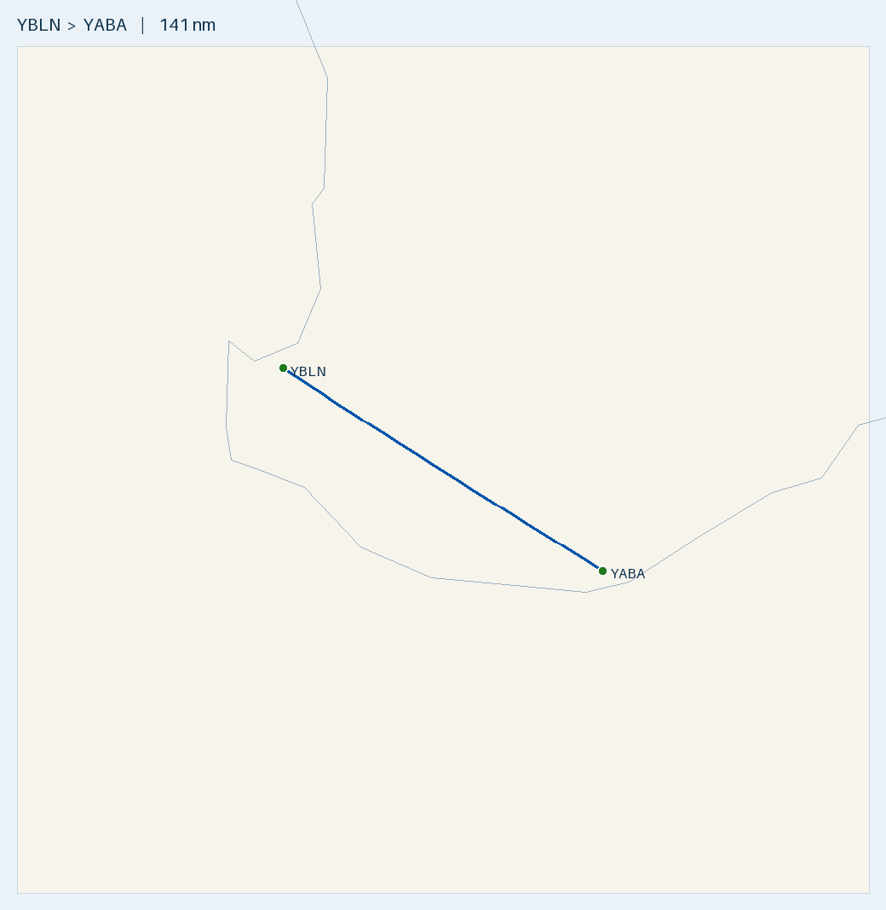

# Flight Plan — YBLN ⇄ YABA return (Tecnam P2002 Sierra, Mogas/AVGAS)

**Route:** Busselton (YBLN) ⇄ Albany (YABA) — **return, weekend away** · each leg **141 nm**, track out **~123°T / ~125°M**, back **~303°T / ~305°M**
**Aircraft:** [Tecnam P2002 Sierra](../../aircraft/P2002.md) · Rotax 912 ULS · Empty **330 kg** · MTOW **600 kg** · 99 L usable
**Planning basis:** No wind · Cruise 100 KTAS · Burn **20 L/hr** (conservative; POH ~15–18) · reserve 15 L (45 min)
**Loading:** 2 occupants **150 kg** + baggage **10 kg** + equipment **5 kg** = **165 kg** · **departing Busselton with FULL fuel (99 L)**
**Data source:** ERSA FAC/RDS effective **09 JUL 2026** — verify against current ERSA + NOTAMs on the day.

> ✈️ **Bottom line:** the P2002 does the **whole return on one Busselton fill — no uplift at Albany needed in normal
> wind.** Round trip burns ~60 of 99 L; you land back at Busselton with **~39 L** (~2.5× the 45-min reserve). But
> it's the thinner-margin aircraft, and legs are ~2 days apart so wind won't cancel out-and-back — **if the
> return-day forecast shows a headwind ≳ 25–30 kt, top up at Albany** (see the return-leg table). At 330 kg empty,
> full fuel + the 165 kg load = 566 kg, 34 kg under MTOW ✓.

---

## Route Summary (return)

| Leg | Day | From → To | Distance | Time @ 100 kt | Trip fuel (L) |
|-----|-----|-----------|---------:|--------------:|--------------:|
| 1 (out) | Sat | YBLN → YABA | 141 nm | 1 h 25 m | ~30 (incl. taxi) |
| 2 (back) | Sun/Mon | YABA → YBLN | 141 nm | 1 h 25 m | ~30 (incl. taxi) |
| **Round trip** | | | **282 nm** | **~2 h 49 m** | **~60 of 99** |

- Full tank ≈ **~5 h** endurance — the round trip uses ~60%.
- All in WA (AWST) — no timezone change; each leg ~1.5 h, easy inside any daylight window.

## Fuel plan — one fill does the weekend (watch the return-day wind)

- **Depart Busselton full (99 L Mogas).** Arrive Albany with **~69 L**.
- **Return in normal wind needs no refuel:** depart Albany on that ~69 L, land Busselton with **~39 L** (reserve 15 L).
- **Albany has NO Mogas** — AVGAS 100LL only (Air BP Carnet, H24). The 912 ULS runs on 100LL (accept greater
  valve-seat wear/deposits from prolonged use). If a top-up is needed for a strong-headwind return, it's AVGAS.

### Return leg (YABA → YBLN) — fuel on landing at Busselton, departing Albany with ~69 L

| Wind on return | Groundspeed | Land YBLN with | Over 45-min reserve (15 L) |
|----------------|------------:|---------------:|---------------------------:|
| Still air | 100 kt | ~39 L | **+24 L (~1.2 h)** |
| 15 kt headwind | 85 kt | ~34 L | +19 L |
| 25 kt headwind | 75 kt | ~30 L | +15 L |
| 30 kt headwind | 70 kt | ~27 L | +12 L |
| 35 kt headwind | 65 kt | ~24 L | +9 L (~27 min) — **top up at Albany** |

**Guidance:** in nil–moderate wind, fly the return on the fuel you land with. **If the return-day forecast shows a
persistent headwind ≳ 25–30 kt, splash AVGAS at Albany** to restore a full 45-min-plus reserve — cheap insurance,
and it keeps you off the thin end of the table. (A 35 kt headwind at 100 KTAS is a marginal-VFR day anyway.)

## Route Map

- 🗺️ **[Interactive version: `map.geojson`](map.geojson)** — GitHub renders it as a pan/zoom map (drawn one direction; the return retraces it).
- 🌐 **[Great Circle Mapper](https://www.gcmap.com/mapui?P=YBLN-YABA)**
- Regenerate: `.venv/bin/python scripts/route_map.py map YBLN YABA --out flightplans/P2002/YBLN-YABA`

---

## Weight & Balance

**Outbound (full fuel + 165 kg) is the heavy case**, using this aircraft's planning empty weight 330 kg (useful load 270 kg):

| Item | Mass (kg) | Mass (lb) | Arm (in) | Moment |
|------|----------:|----------:|---------:|-------:|
| Empty (this airframe) | 330 | 728 | ~67.8 *(confirm empty arm from W&B record)* | 49,358 |
| Occupants (2) | 150 | 331 | 70.86 | 23,455 |
| Baggage + equipment | 15 | 33 | 86.61 | 2,858 |
| Full usable fuel (99 L) | 71 | 157 | 60.23 | 9,456 |
| **Ramp / takeoff** | **566** | **1249** | **~68.2** | 85,127 |

- **Takeoff 566 kg < 600 MTOW ✓** (34 kg margin) · **max fuel to MTOW = 105 kg, so full 71 kg fits easily.**
- **Baggage 15 kg < 20 kg limit ✓** (put the 5 kg equipment in the baggage bay to keep total ≤ 20 kg).
- **CG ~68.2 in — within 63.4–70.4 in envelope ✓** (representative empty arm; confirm yours).
- **Return leg is lighter** (departs Albany with ~69 L, not full) → further inside MTOW; a full top-up at Albany
  returns you to the outbound case above (still fine).

---

## Aerodromes

### [YBLN](../../aerodromes/YBLN.md) — Busselton (WA) — HOME BASE
- Position: -33.687, 115.400 · Elev 56 ft · AVGAS + Jet A1 (+ aeroclub Mogas) · CTAF 127.0 · RWY 03/21 TORA 2460 m, grooved, 45 m wide

### [YABA](../../aerodromes/YABA.md) — Albany (WA) — WEEKEND DESTINATION
- Position: -34.943, 117.809 · Elev 233 ft · AVGAS + Jet A1 (**no Mogas**) · CTAF 127.85
- RWY 14/32: TORA 1800 m · RWY 05/23: TORA 1096 m (both 30 m wide)

## Fuel & Payment
- **Depart Busselton on Mogas** (aeroclub supply — RON 95+ ethanol-free; fuel before departure).
- **Albany: AVGAS 100LL only** (Air BP **Carnet**, H24). Only needed if you top up for a strong-headwind return.
- Carry an **Air BP Carnet** for that contingency.

## Pre-Flight Checks
- [ ] W&B done: empty **330 kg** → takeoff **566 kg**, 34 kg under MTOW ✓ (confirm empty weight/arm on the day).
- [ ] Baggage + equipment ≤ **20 kg** limit; secure with the tie-down net.
- [ ] Mogas (RON 95+, ethanol-free) confirmed at Busselton aeroclub; fill full before departure.
- [ ] **Check the RETURN-day forecast separately** (legs ~2 days apart) — if headwind ≳ 25–30 kt, plan an AVGAS top-up at Albany.
- [ ] Confirm ~69 L on arrival Albany; decide top-up vs no-uplift from the return-leg table + actual wind.
- [ ] ARFOR + TAFs + NOTAMs for YBLN, YABA on **both** days; crosswind ≤ 22 kt demonstrated (check Albany RWY 14/32 & 05/23).
- [ ] Current ERSA/AIP; charts + GPS current; SARTIME/flight notes as desired for each leg.

---
*Planning only. Cross-check current ERSA, NOTAMs, weather, W&B and the P2002 Flight Manual before flight.*
