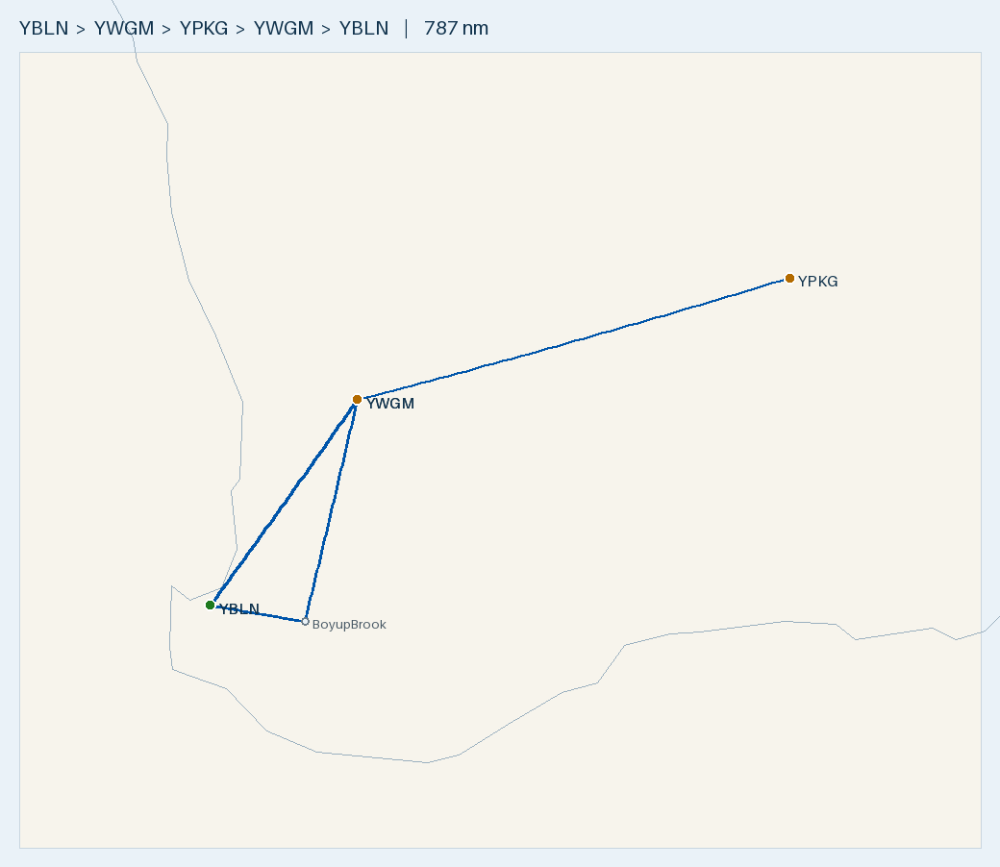

# Plan 1 — Busselton → Kalgoorlie → Busselton (via White Gum, return through Boyup Brook)

**Route (2-day, White Gum fuel both ways · Northam YNTM the alternate):**
- **Day 1 (out):** YBLN → **YWGM** → YPKG — *sleep at Kalgoorlie*
- **Day 2 (back):** YPKG → **YWGM** → **Boyup Brook** → YBLN
**Aircraft:** 2 × [Tecnam P2002 Sierra](../../aircraft/P2002.md) on the return · Rotax 912 ULS · MTOW **600 kg** · 99 L usable
**Planning basis:** No wind · Cruise 100 KTAS · Burn **20 L/hr** (conservative; POH ~15–18) · **final reserve 10 L (30 min, day VFR)**
**Loading (per aircraft):** occupants **170 kg** + cargo **20 kg** = **190 kg** · **full fuel at each fuelled departure**
**Data source:** ERSA FAC/RDS effective **09 JUL 2026** — verify against current ERSA + NOTAMs on the day.

> ✈️ **Bottom line:** Fuel at **White Gum (Mogas) both ways** with **Northam (YNTM, 19 nm) as the alternate** — every
> fuelled leg departs full and lands with 40+ L, so wind is never a range problem. **On Day 2 two aircraft fly home
> together; at Boyup Brook one stays for its annual and everyone consolidates into a single aircraft** for the short 50 nm
> hop to Busselton. That last leg is well under MTOW **because it's flown on a small fuel load** (see W&B) — full tanks
> *would* bust MTOW in the heavier airframe, but 50 nm doesn't need them.

---

## Route Summary

| Leg | Day | From → To | Distance | Track | Time @ 100 kt | Trip fuel (L) |
|-----|-----|-----------|---------:|------:|--------------:|--------------:|
| OUT 1 | 1 | YBLN → YWGM | 134 nm | ~036°T | 1 h 20 m | ~29 |
| OUT 2 | 1 | YWGM → YPKG | 241 nm | ~076°T | 2 h 24 m | ~50 |
| **Outbound** | 1 | **YBLN → YPKG** | **375 nm** | | **~3 h 44 m** | *sleep Kalgoorlie* |
| RTN 1 | 2 | YPKG → YWGM | 241 nm | ~253°T | 2 h 24 m | ~50 |
| RTN 2 | 2 | YWGM → Boyup Brook | 121 nm | ~193°T | 1 h 13 m | ~26 |
| RTN 3 | 2 | Boyup Brook → YBLN | 50 nm | ~280°T | 0 h 30 m | ~12 |
| **Return** | 2 | **YPKG → YBLN** | **412 nm** | | **~4 h 07 m** | |
| **Round trip** | | | **787 nm** | | **~7 h 51 m** | |

- All WA (AWST) — no timezone change. Longest single leg is 241 nm (~2.4 h), well inside the ~5 h full-tank endurance.

## Fuel plan — top up Mogas at White Gum (Northam the alternate)

| Departure | Fuel type | Depart | Leg | Land with (nil wind) | Over 30-min reserve (10 L) |
|-----------|-----------|-------:|-----|---------------------:|---------------------------:|
| YBLN | Mogas (aeroclub) | 99 L | → YWGM 134 nm | ~70 L | +60 L |
| YWGM | **Mogas (bowser)** | 99 L | → YPKG 241 nm | **~49 L** | **+39 L** |
| *— sleep Kalgoorlie —* | | | | | |
| YPKG | AVGAS 100LL | 99 L | → YWGM 241 nm | **~49 L** | **+39 L** |
| YWGM | **Mogas (bowser)** | 99 L | → Boyup → YBLN 171 nm | **~62 L** at YBLN | +52 L (Boyup has no fuel) |

- **Wind is not a range issue** — every leg departs full; the longest (241 nm) still lands ~33 L even in a 25 kt headwind.
- **⛽ Alternate if White Gum is dry → Northam (YNTM), 19 nm WNW** — sealed 14/32 (1248 m), **AVGAS H24 credit-card
  bowser**, no PPR. You reach White Gum with ~49 L, so the diversion costs ~4 L. AVGAS not Mogas, but the 912 runs on it.
- **Fuel type:** Mogas at Busselton and White Gum (the 912's preferred fuel); **only the Kalgoorlie→White Gum leg is AVGAS**.
- **Boyup Brook has no fuel** — from a full White Gum tank the 171 nm to Busselton (via the Boyup stop) lands ~62 L.

## Day 2, two aircraft — Boyup Brook annual drop & consolidation

- Both P2002s fly **YPKG → YWGM → Boyup Brook** together (loose trail, individual CTAF calls; agree spacing/joining for
  White Gum's sand strip — one in, one holding).
- **At Boyup Brook one aircraft stays for its annual.** Everyone consolidates into the other aircraft; **anything over the
  20 kg baggage limit stays with the parked aircraft**.
- The remaining aircraft flies the **50 nm Boyup Brook → YBLN** leg (see the final-leg W&B below).

## Weight & Balance

**Fuelled legs — full fuel + 190 kg is the heavy case (planning empty 330 kg):**

| Item | Mass (kg) | Arm (in) | Moment (kg·in) |
|------|----------:|---------:|---------------:|
| Empty (planning) | 330 | ~67.8 | 22,374 |
| Occupants | 170 | 70.86 | 12,046 |
| Cargo | 20 | 86.61 | 1,732 |
| Full fuel (99 L) | 71 | 60.23 | 4,276 |
| **Takeoff** | **591** | **68.4** | **40,429** |

- **591 kg < 600 MTOW ✓** (9 kg margin); CoG 68.4 in full → 69.5 in dry, inside 63.4–70.4 ✓. Valid **only if empty ≤ 339 kg**
  — at the POH-sample 339.7 kg you'd be ~1 kg over, so carry ~2 L less or trim cargo. Confirm the real empty weight.

**Final leg Boyup Brook → YBLN (50 nm) — the consolidated aircraft, even at 355 kg empty:**

| Fuel aboard | 355 kg empty + 2 pax (170) + 20 cargo | MTOW | CoG |
|------------:|--------------------------------------:|:----:|----:|
| Full 99 L | 616 kg | ❌ over | 68.4 in |
| ~73 L (as arrived) | ~598 kg | ✅ under (2 kg) | 68.5 in |
| 30 L (ample for 50 nm) | 567 kg | ✅ under | 69.1 in |

- **MTOW is not a limit here — because you're light on fuel.** 50 nm needs ~12 L + reserve, so don't top up beyond need.
  At ~73 L in the 355 kg airframe the margin is only ~2 kg, so **do the actual W&B** and keep cargo ≤ 20 kg. The 330 kg
  airframe is fine even brim-full (591 kg). Being light also helps the takeoff off Boyup Brook's ALA.

## Route Map

- 🗺️ **[Interactive: `map.geojson`](map.geojson)** · 🌐 **[Great Circle Mapper](https://www.gcmap.com/mapui?P=YBLN-YWGM-YPKG-YWGM-YMJM-YBLN)** (Manjimup ≈ Boyup Brook)
- Regenerate: `.venv/bin/python scripts/route_map.py map YBLN YWGM YPKG YWGM "BoyupBrook@-33.83,116.39" YBLN --out flightplans/P2002/YBLN-YPKG-YBLN`

## Density altitude
- **Kalgoorlie 1203 ft, White Gum 1000 ft, Boyup Brook ~900 ft** — warm-day density altitude climbs well above these; the
  98 hp Rotax loses climb and lengthens the roll. **Check TODR**, prefer early-morning departures near MTOW.

---

## Aerodromes

### [YBLN](../../aerodromes/YBLN.md) — Busselton (WA) — HOME BASE (Day 1 depart, Day 2 arrive)
- -33.687, 115.400 · Elev 56 ft · AVGAS + Jet A1 (+ **aeroclub Mogas**) · CTAF 127.0 · RWY 03/21 grooved, 2460 m, 45 m wide

### [YWGM](../../aerodromes/YWGM.md) — White Gum (WA) — FUEL STOP (both ways, Mogas)
- -31.867, 116.939 · Elev 1000 ft · **UNCR, private — PPR** · CTAF 126.7 · **MOGAS bowser** (TWY east of RWY 14/32)
- **RWY 14/32 1400 m SAND; 09/27 750 m gravel** (ample) · confirm PPR + Mogas for **both** days.

### [YNTM](../../aerodromes/YNTM.md) — Northam (WA) — FUEL ALTERNATE (if White Gum dry)
- -31.626, 116.684 · Elev 500 ft · **UNCR** · CTAF 124.2 · **AVGAS H24 credit-card bowser** (no Jet A1) · RWY 14/32 1248 m sealed · **~19 nm WNW of White Gum**

### [YPKG](../../aerodromes/YPKG.md) — Kalgoorlie-Boulder (WA) — OVERNIGHT / REFUEL
- -30.789, 121.462 · Elev 1203 ft · AVGAS + Jet A1 + F34 (**no Mogas**) · CTAF/UNICOM 126.6 · RWY 11/29 2000 m sealed; 18/36 1200 m · **H24 AVGAS card bowser** (Carnet/credit)

### Boyup Brook (WA) — Day 2 STOP (one aircraft stays for annual) — **unlisted ALA**
- Approx -33.83, 116.39 · **Not in ERSA FAC** — coordinates approximate. **Confirm exact position, runway, surface,
  condition, PPR with the operator.** No fuel. Nearest listed diversion: **Manjimup (YMJM, AVGAS, ~28 nm)**.

## Pre-Flight Checks
- [ ] **PPR + Mogas confirmed at White Gum for BOTH days**; if unavailable, divert to **Northam (YNTM, ~19 nm)**.
- [ ] **W&B each aircraft** against real empty weight — fuelled legs ≤ 600 kg (591 planned, needs empty ≤ 339 kg).
- [ ] **Final Boyup→YBLN leg:** consolidated aircraft W&B on the day — keep fuel modest so it's under MTOW; cargo ≤ 20 kg (excess stays with the parked aircraft).
- [ ] Busselton Mogas full before Day 1 departure; Kalgoorlie AVGAS to full before Day 2; Carnet/credit carried.
- [ ] **Two-aircraft brief:** loose trail, individual CTAF calls, spacing/joining plan for White Gum sand strip and Boyup Brook.
- [ ] **Confirm Boyup Brook strip** (position, runway, surface, PPR) — not in ERSA; diversion Manjimup.
- [ ] Density altitude / TODR for Kalgoorlie, White Gum, Boyup Brook; cool-of-day departures near MTOW.
- [ ] ARFOR/TAFs + NOTAMs for YBLN, YWGM, YNTM, YPKG on both days; crosswind ≤ 22 kt demonstrated; water + PLB on the inland legs.

---
*Planning only. Cross-check current ERSA, NOTAMs, weather, W&B and the P2002 Flight Manual before flight.*
