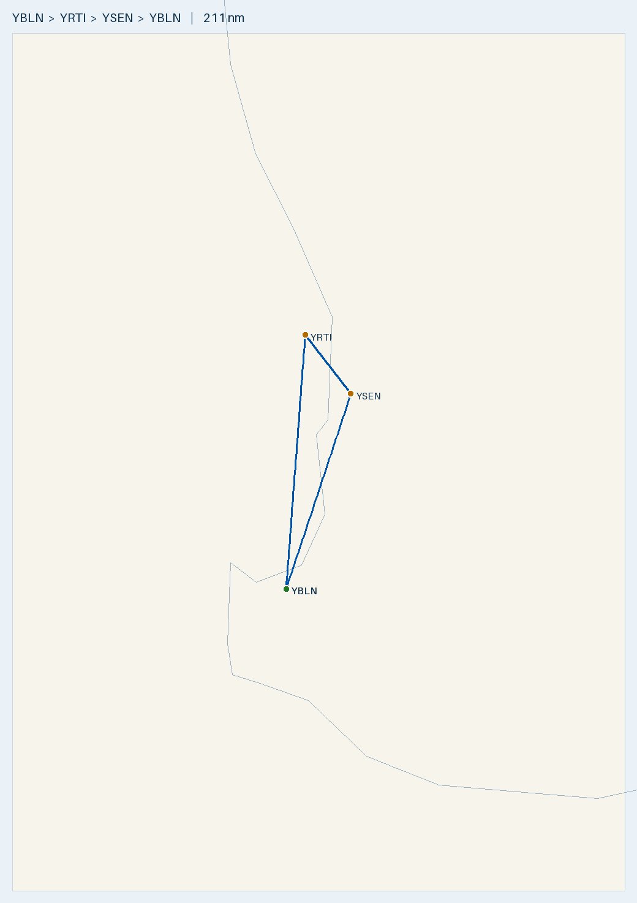

# Busselton → Rottnest Island → Serpentine → Busselton (P2002 day trip)

**Route (single day, one tank):**
- YBLN → **YRTI** (Rottnest Island) → **YSEN** (Serpentine) → YBLN
**Aircraft:** [Tecnam P2002 Sierra](../../aircraft/P2002.md) · Rotax 912 ULS · MTOW **600 kg** · 99 L usable
**Planning basis:** No wind · Cruise 100 KTAS · Burn **20 L/hr** (conservative; POH ~15–18) · **final reserve 10 L (30 min, day VFR)**
**Loading:** occupants **170 kg** · **no cargo** · **assumed empty weight 365 kg** · **partial fuel ~75 L** (full tanks exceed MTOW at this empty weight — see W&B)
**Data source:** ERSA **03 SEP 2026** (YRTI/YSEN read from the live FAC pages) — verify against current ERSA + NOTAMs on the day.

> ✈️ **Bottom line:** This is a short **211 nm** coastal day trip flown on **one partial tank — no refuel anywhere.** The whole trip
> burns only ~42 L, so a **~75 L departure fill** covers it with a huge reserve (land back at Busselton ~33 L). **At the assumed
> 365 kg empty weight you can't fill the tanks anyway** — full fuel + two 85 kg occupants is over MTOW (see W&B), so partial fuel is
> both sufficient and required. Fuel being settled, **airspace is the whole game:** the three legs skirt the **Perth / Jandakot
> terminal area**, so this is a Perth VTC/VNC flight, not an outback one. Two things will bite the unprepared: **Rottnest RWY 09 is
> RIGHT-HAND circuits in daylight** (keep everything south, don't overfly the settlement), and **both Rottnest and Serpentine are
> PPR** (Rottnest also charges a landing fee; Serpentine wants an email first). Serpentine has **Mogas 95 H24** if you ever needed it,
> but this plan does not refuel.

---

## Route Summary

| Leg | From → To | Distance | Track (°T) | Time @ 100 kt | Trip fuel (L) |
|-----|-----------|---------:|-----------:|--------------:|--------------:|
| 1 | YBLN → YRTI | 101 nm | ~004° | 1 h 01 m | ~20 |
| 2 | YRTI → YSEN | 29 nm | ~144° | 0 h 17 m | ~6 |
| 3 | YSEN → YBLN | 81 nm | ~197° | 0 h 49 m | ~16 |
| **Round trip** | | **211 nm** | | **~2 h 07 m** | **~42** |

- All WA (AWST) — no timezone change. VAR ~2–3°W, so magnetic ≈ track + ~2–3°.
- Longest leg is 101 nm (~1 h); even a 25 kt headwind leaves it well inside endurance (~3.5 h on the planned ~75 L fill).

## ⚠️ Airspace — the real planning task

This route runs right up against **Perth Class C** and **Jandakot Class D**. **Plan it on the current Perth VTC and VNC** and brief it before you go:

- **Leg 1 (YBLN → YRTI):** Track up the coast, staying **west of Perth/Jandakot controlled steps**. Rottnest sits under the Perth
  CTA steps — **stay below the applicable step or get a clearance**; read the step bases off the VTC on the day.
- **Leg 2 (YRTI → YSEN):** The awkward one — Rottnest to Serpentine crosses the terminal area **behind (east/south of) Jandakot**.
  Expect to either **transit Jandakot Class D with a clearance/coastal-lane procedure** or route around and beneath the CTA steps.
  Decide this in advance; don't improvise it airborne.
- **Leg 3 (YSEN → YBLN):** Track south clear of the steps back down toward Busselton — mostly Class G once clear of the terminal area.

> Exact step altitudes and VFR routes/lanes change with the chart cycle — **do not fly off the numbers in this plan; use the
> current Perth VTC/VNC and NOTAMs.** If unsure, coastal at low level west of the control steps is the simple, memory-aligned option.

### Perth transit & Rottnest arrival (from CASA *Stay OnTrack – Flying the Perth Region*, 2022)

- **Coastal, under the step.** Track the coast north and stay **at/below the CTA step** to remain in Class G (near Fremantle that's the
  **1,500 ft step**, ~11 nm from Perth — read the current VTC). **Monitor Perth Centre 135.25** (traffic/flight-following within 36 nm).
- **Cross to Rottnest from around Fremantle**, westbound over water. **A crossing at 1,000–1,500 ft is fine** — the CTA step caps you,
  and the **hemispherical cruising-level rule doesn't apply below 5,000 ft**, so a westbound low level is legal. Pick one level and hold
  it (predictable), switch to **RTI CTAF 126.0** in good time.
- **Note: Boatyard (BOAT) / Powerhouse (POWR) / Adventure World are *Jandakot* reporting points** (JKT CTR entry 1,500 ft, departure
  1,000 ft) — they only apply if you actually transit Jandakot Class D (a possible option on Leg 2), **not** as a Rottnest arrival.
- **Rottnest join — get the wind, then join from the SOUTH.** AWIS **134.35** (1-sec pulse; 90 s) + listen on CTAF to pick the runway.
  **Both directions keep the circuit south** of the strip (RWY 09 = RH, RWY 27 = standard LH), so you never overfly the N-side
  settlement. Circuit height ~1,000 ft AGL.
- **🔴 CASA warning:** RTI CTAF is busy (private, IFR/VFR training, charter, military, shark-spotter & **parachute** flights) and
  **parachute landing areas can be very close to the runway centreline on finals** — build the traffic picture early, speak up if unsure.
- **❓ Join technique — CONFIRM WITH MAURO:** an overhead + dead-side descent is awkward here because the **dead side of a southern
  circuit is the N (settlement) side you can't overfly.** Likely cleaner to **arrive from the south already at circuit height and join
  crosswind/mid-downwind directly** — but run the exact join, and parachute deconfliction on final, past your instructor.

## 🌊 Over-water — Rottnest crossing (lifejackets required)

Rottnest is an island ~11 nm off the coast, and the single-engine P2002 will be **beyond gliding distance of land** on the crossing —
made worse by being **capped at ≤1,500 ft** by the Perth CTA step, so you can't buy glide range with height.

- **✅ Lifejackets (one per occupant) and a PLB are carried.** **Wear the lifejackets** (or have them immediately accessible) for the
  over-water segments to and from Rottnest, and keep the PLB on a person, not in the baggage area.
- **Brief ditching before feet-wet:** best glide, into-wind touchdown, exits, and **inflate lifejackets only *outside* the aircraft.**
- Cross by the shortest sensible over-water track (depart the coast around Fremantle) to minimise open-water exposure. Water is cold
  enough that survival time matters — the lifejacket + PLB is what gets you found.

## Fuel plan — partial fill at Busselton, NO refuel en route

**Depart YBLN with ~75 L** (54 kg). That covers the ~42 L trip with a big margin and keeps you under MTOW at 365 kg empty. No refuel is planned or needed.

| Departure | Fuel type | Depart | Leg | Land with (nil wind) | Over 30-min reserve (10 L) |
|-----------|-----------|-------:|-----|---------------------:|---------------------------:|
| YBLN | Mogas (aeroclub) or AVGAS | ~75 L | → YRTI 101 nm | ~55 L | +45 L |
| YRTI | *(no fuel)* | ~55 L | → YSEN 29 nm | ~49 L | +39 L |
| YSEN | *(no refuel — Mogas 95 avail if ever needed)* | ~49 L | → YBLN 81 nm | ~33 L | +23 L |

- **Wind is never a range issue** — the whole trip burns ~42 L; even a 25 kt headwind on the 101 nm leg leaves comfortable reserves.
- **Rottnest has NO fuel. Serpentine has Mogas 95 + AVGAS H24** (PPR to confirm), but **this plan does not refuel** — a full ~75 L
  departure from Busselton does the whole loop. Keep the departure fuel modest so you stay under MTOW (see W&B) — don't just brim it.

## Weight & Balance — ⚠️ full tanks are NOT possible at 365 kg empty

**At the assumed 365 kg empty weight, empty + two 85 kg occupants (170 kg) already = 535 kg, leaving only 65 kg (~90 L) for fuel
before MTOW.** Full tanks (99 L / 71 kg) would put you at **606 kg — 6 kg over MTOW.** So this trip is flown on a partial fill.

**Planned takeoff — empty 365 + occupants 170 + ~75 L (54 kg), no cargo:**

| Item | Mass (kg) | Arm (in) | Moment (kg·in) |
|------|----------:|---------:|---------------:|
| Empty (assumed) | 365 | ~67.8 | 24,747 |
| Occupants | 170 | 70.86 | 12,046 |
| Cargo | 0 | 86.61 | 0 |
| Fuel (~75 L) | 54 | 60.23 | 3,252 |
| **Takeoff** | **589** | **68.0** | **40,046** |

- **589 kg < 600 MTOW ✓** (11 kg margin); CoG **68.0 in** at takeoff → ~68.4 in as fuel burns off, inside **63.4–70.4** ✓.
- **Absolute fuel ceiling is ~90 L (65 kg)** — that puts you *exactly* at 600 kg MTOW with these occupants, so **75 L gives a safe
  buffer**. If occupants are heavier than 170 kg total, reduce fuel further (every 10 kg of people = ~14 L less fuel).
- **These numbers assume an empty arm of ~67.8 in — that is a placeholder.** Empty weight AND empty CG are airframe-specific;
  **compute the real W&B from this aircraft's Weight & Balance Record before flight**, especially at a 365 kg empty weight.

## Aerodrome hazards & circuits (read these — they're the point of this trip)

### [YBLN](../../aerodromes/YBLN.md) — Busselton (WA) — HOME BASE
- -33.687, 115.400 · Elev 56 ft · **AVGAS + Jet A1 (+ aeroclub Mogas)** · CTAF 127.0 · RWY 03/21 grooved, 2460 m, 45 m wide.
- Standard circuits; big sealed runway. Confirm aeroclub Mogas availability before relying on it.

### [YRTI](../../aerodromes/YRTI.md) — Rottnest Island (WA) — **PPR + landing fee, RIGHT-HAND circuits**
- -32.007, 115.540 · Elev 12 ft · CERT · **CTAF 126.0** · RWY **09/27**, 18 m wide (09 LDA 1293 m; **27 LDA only 1121 m** — displaced).
- **🔴 SEVERE — active parachute (PJE) drop zone over the bays** (Bickley/Salmon/Thompson) — canopies + a climbing/running jump aircraft in the circuit area, coming down from above. **Monitor CTAF 126.0 for jump calls; be ready to hold.**
- **🔴 SEVERE — busy fly-in destination** on fine days: expect lots of traffic and non-standard joins. Continuous lookout.
- **🟠 RWY 09 RIGHT-HAND circuits required in daylight (non-standard). Do NOT overfly the settlement on the N side — keep circuits south.**
- **🟠 Obstacles:** hill 79 ft **infringes RWY 27 approach**; trees on RWY 27 approach; **train on the railway can encroach the W end of RWY 09**; lighthouse & lit wind turbine to the W.
- **🟡 Wildlife:** quokka + migratory birds on/near the runway.
- **🟢 Admin:** PPR from AD MGR for night ARR/DEP; daylight ops only (HJ); **landing/usage charge on all aircraft** (Avdata); AD MGR **0400 631 696**. AWIS **134.35** (1-sec pulse) or 08 6216 2635. Runway lights emergency only. **No fuel.**

### [YSEN](../../aerodromes/YSEN.md) — Serpentine (WA) — **PPR, Mogas 95, shared CTAF with Murray Field**
- -32.395, 115.873 · Elev 30 ft · UNCR · **CTAF 119.1** · RWY 05/23 sealed 900 m (RWY 23 100 m displaced thr) · RWY 09/27 grass 600 m.
- **🔴 SEVERE — low-level aerobatics in the vicinity:** aircraft manoeuvring hard/unpredictably at low level. Continuous lookout, clear position calls.
- **🔴 SEVERE — shares CTAF 119.1 AND runway designators (05/23, 09/27) with Murray Field (YMUL)** nearby — acting on the wrong field's call is a collision trap. **Say the aerodrome name in every single call.**
- **🟠 Circuits LEFT hand both runways; RWY 05 min circuit height 1,000 ft; no circuits before 0800 Sundays.**
- **🟠 Obstacles:** HV powerlines 900 m W of boundary; **trees to 10 m on short final RWY 27.**
- **🟡 Wildlife:** kangaroo + bird hazard. **Manoeuvre on TWY/RWY only — soft sand off the pavement.**
- **🟢 Admin:** PPR — email **committee@sabc.org.au** (also to confirm fuel); sport/recreational only, no flight-school training; Mogas 95 + AVGAS H24 (not used this trip); lighting RWY 05/23 MIRL **PAL 125.3**; grass sprinklers may run in summer; emergency-services helicopters H24.

## Route Map

- 🗺️ **[Interactive: `map.geojson`](map.geojson)** · 🌐 **[Great Circle Mapper](https://www.gcmap.com/mapui?P=YBLN-YRTI-YSEN-YBLN)**
- Regenerate: `.venv/bin/python scripts/route_map.py map YBLN YRTI YSEN YBLN --out flightplans/P2002/YBLN-YRTI-YSEN`

## Density altitude
- All three fields are near sea level (12–56 ft), so density altitude is a non-issue for climb — but a warm day still lengthens the
  roll. Note **Rottnest RWY 27 LDA is only 1121 m** and **Serpentine's sealed runway is 900 m** — fine for the P2002, but do the TODR/LDR.

## Pre-Flight Checks
- [ ] **🌊 Lifejackets (carried ✅) worn/accessible + PLB (carried ✅) on a person** for the over-water Rottnest crossing; **ditching brief** before feet-wet.
- [ ] **Airspace brief on the current Perth VTC/VNC** — step bases over Rottnest, and the Rottnest→Serpentine terminal-area crossing (Jandakot Class D clearance or a beneath-CTA/coastal route). NOTAMs for the Perth terminal area.
- [ ] **Rottnest PPR (night only) + landing fee** — daylight ops (HJ); expect an Avdata charge. AD MGR 0400 631 696 if needed.
- [ ] **Serpentine PPR — email committee@sabc.org.au** ahead of time (and to confirm Mogas/AVGAS). Carry a Dunning card or Visa/MC.
- [ ] **Rottnest RWY 09 = RIGHT-HAND circuits (daylight); keep south of / clear of the settlement.** Get AWIS 134.35 for the runway; join from the south. **❓ Confirm the exact join technique (direct southern join vs overhead) + parachute deconfliction with Mauro.**
- [ ] **Serpentine shares CTAF 119.1 + RWY designators with Murray Field (YMUL)** — use the field name on every call; RWY 05 min CCT 1,000 ft; no circuits before 0800 Sun.
- [ ] **🔴 Traffic:** brief PJE/parachute ops + heavy fly-in traffic at Rottnest, and low-level aerobatics near Serpentine — continuous lookout, monitor CTAF early.
- [ ] Wildlife brief: **quokka + birds at Rottnest**, **kangaroos + birds at Serpentine**.
- [ ] Obstacles: hill/trees on Rottnest RWY 27 approach, train at RWY 09 W end; powerlines + trees short final RWY 27 at Serpentine.
- [ ] **W&B on the day: full tanks bust MTOW at 365 kg empty** — depart ~75 L (≤90 L absolute); reduce fuel if occupants > 170 kg; compute real empty weight AND empty CG.
- [ ] ARFOR/TAFs (Perth) + NOTAMs; crosswind ≤ 22 kt demonstrated; note Serpentine soft sand off pavement.

---
*Planning only. Cross-check current ERSA, NOTAMs, weather, W&B and the P2002 Flight Manual before flight.*
