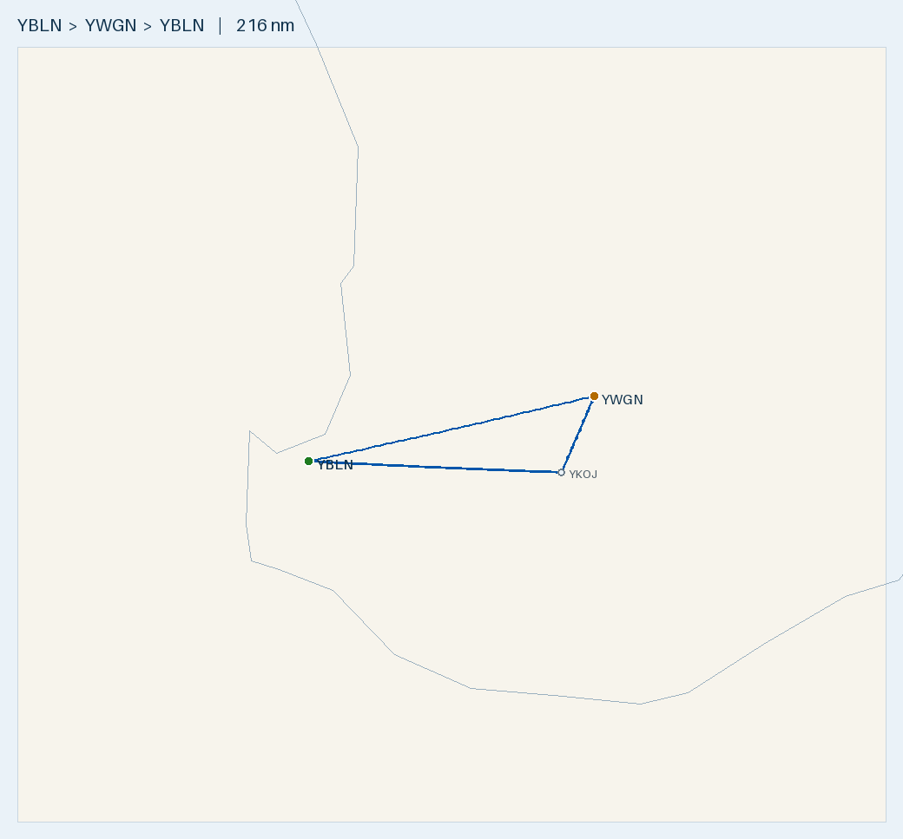

# Plan — Solo XC nav: Busselton · Wagin · Kojonup · Busselton

**Route:** YBLN → **YWGN Wagin** (full stop) → **YKOJ Kojonup** (touch-and-go or full stop) → YBLN · solo (1 POB)
**Aircraft:** [Tecnam P2002 Sierra](../../aircraft/P2002.md) · 99 L usable · MTOW 600 kg
**Planning basis:** 100 KTAS · 20 L/hr · reserve 10 L (30 min) · var 3°W · **wind 360°/3 kt** (assumed; recheck the forecast on the day) · cruise **5,500 ft eastbound / 4,500 ft westbound**
**Data:** ERSA **03 SEP 2026** (current) for YBLN and YWGN. Wagin is unchanged in the 26 NOV 2026 pending cycle. Kojonup is a Shire ALA, not in ERSA (verify on the day).

> ✈️ **Bottom line:** ~**216 nm**, **~2 h 16 m flying / ~2 h 31 m total** with a 15-min stop at Wagin (wind 360°/3 kt). One Mogas fill at
> Busselton does it, since there's no usable fuel en route. You land with **~54 L (+44 L over reserve)**, and even a 20 kt headwind on every
> leg leaves +33 L. Solo with full tanks you're 74 kg under MTOW. Watch out for the
> **Hillman Farm parachute DZ** (~9 nm off leg 1) and **Zone Five** (monitor 126.7, within 10 nm on legs 1 & 3).

---

## Route Summary (wind 360°/3 kt)

Headings are wind-corrected for **360°/3 kt** and include 3°W variation. Times include a **+2 min climb allowance per leg** (1 min / 2,000 ft).

| Leg | Segment | Dist (nm) | Track °T | HDG °T / °M | GS (kt) | Cruise alt | Time | Leg fuel (L) | Cum. time | Fuel left (L) |
|:---:|---------|----------:|:--------:|:-----------:|--------:|:----------:|-----:|-------------:|----------:|--------------:|
| 1 | YBLN → YWGN Wagin | 100.6 | 078 | 076 / 079 | 99 | 5,500 | 63 m | 20.9 | 63 m | 78 |
| — | *Wagin ground stop* | — | — | — | — | — | *15 m* | — | 78 m | 78 |
| 2 | YWGN Wagin → YKOJ Kojonup | 28.4 | 203 | 204 / 207 | 103 | 4,500 | 19 m | 6.2 | 97 m | 72 |
| 3 | YKOJ Kojonup → YBLN | 86.8 | 272 | 274 / 277 | 100 | 4,500 | 54 m | 18.0 | 151 m | 54 |
| **—** | **Total** | **216** | — | — | — | — | **2 h 16 m flying · 2 h 31 m total** | **~45** | — | **~54** |

- **Cruise altitudes:** **5,500 ft eastbound (leg 1)** and **4,500 ft westbound (legs 2 & 3)**. Both are above the trip's highest LSALT of **3,000 ft** (ERC Low).
- **Wind 360°/3 kt is nearly calm.** It costs about 1 min and 0.2 L over nil wind, and the largest drift correction is under 2°. If the actual wind is stronger, re-run the wind correction for each leg.
- **Kojonup is planned as a touch-and-go**, so there's no ground time. If you make it a full stop, add your ground time.
- **Leg 1 is the long, wind-sensitive leg:** ~100 nm over open wheatbelt with few line features. Treat it as a DR and timing leg, and recheck the forecast before you commit.
- **If the forecast changes:** for each leg, work out the WCA. THDG = track + WCA, and MHDG = THDG + 3°W. Then re-time the leg (dist ÷ GS) and re-fuel it (time × 20 L/hr).
- **Runways in 360°/3 kt:** effectively calm everywhere. The slightly into-wind choices are YBLN **03**, Wagin **06** (sealed; the other runway is gravel 17/35) and Kojonup **34** (it has only 16/34). Confirm the active runway on each CTAF.

## Radio & en-route hazards

| Where | What | Action |
|-------|------|--------|
| Busselton (departure and arrival) | **Bird hazard** (ERSA): possibly large numbers of wetland birds around the aerodrome | Keep a lookout on takeoff, climb-out, approach and landing. Be ready to go around |
| Legs 1 & 3, ~25 nm from YBLN | **Zone Five (YZON)** airstrip, Brookhampton (-33.667, 115.903, 768 ft). You pass ~4.2 nm abeam outbound and ~2.5 nm abeam inbound | **Monitor and broadcast on 126.7** within 10 nm |
| Leg 1, ~75 nm out | **Hillman Farm (YHLM)**, Darkan (-33.264, 116.815), an active **parachute DZ to 14,000 ft**, ~9 nm NW of track | Check NOTAMs and the DZ freq. Listen for jump calls and widen the offset (5+ nm) if jumps are active |
| Wagin aerodrome | **Model aircraft** (ERSA). They fly within a **1,000 m radius of the field, SFC–1,000 ft AGL**. The operator monitors **126.7** (tel 0421 966 168) | Listen for them on 126.7 and make clear calls. Join and stay in the circuit above 1,000 ft AGL until established, and look out on final and climb-out |
| Leg 1, ~14 nm before Wagin (~87 nm out) | Melbourne Centre **124.9 → 125.4** | Change frequency. Confirm the boundary on the ERC-L |
| Leg 2, ~10 nm before Kojonup (~18 nm out of Wagin) | Melbourne Centre **125.4 → 124.9** | Change **just after your 10 nm inbound call** to Kojonup, which is on 124.9 (VNC). All of leg 3 is 124.9 |

- **No controlled airspace on the route (Class G).** Perth CTA is well to the north.
- **No ERSA-registered aerodrome lies within 10 nm.** The nearest is Bunbury at ~15 nm (shares CTAF 127.0 with Busselton). Next are Dumbleyung (~19 nm), Margaret River (~21 nm), Katanning (~23 nm) and Narrogin (~26 nm). Unregistered farm and ag strips aren't charted, so keep a lookout.
- **Area frequencies:** Wagin, Katanning and Narrogin are on **125.4**. Busselton, Bunbury, Margaret River and **Kojonup** are on **124.9** (VNC). That means you're on 125.4 only around Wagin: from 14 nm before Wagin until about 10 nm before Kojonup.

## Fuel Plan

**One fill at Busselton covers the whole trip.** Fill Mogas through the aeroclub (off-book, so arrange it ahead). There's **no usable fuel en route**: Wagin's AVGAS is emergency-only and Kojonup has none.

| Point | Expected on board | Needed from here to YBLN + 10 L reserve | Spare | Endurance left (20 L/hr) |
|-------|------------------:|----------------------------------------:|------:|-------------------------:|
| Depart YBLN (full) | **99 L** | 55 L | **+44 L** | ~4 h 57 m |
| Wagin (after leg 1; **dip here**) | **~78 L** | 35 L | **+43 L** | ~3 h 54 m |
| Kojonup (touch-and-go; check the gauges) | **~72 L** | 28 L | **+44 L** | ~3 h 36 m |
| Land YBLN | **~54 L** | 10 L (reserve) | **+44 L** | ~2 h 42 m |

- **Minimum to continue from Wagin: 35 L.** If your dip shows much less than ~78 L, find out why before you go on. Look for a leak, a cap left off, or burn higher than planned.
- **Headwind stress test:** a **20 kt headwind on every leg** (worst case) takes ~2 h 48 m of flying and burns ~56 L. You'd still land with ~43 L, which is **+33 L over reserve**.
- **The 20 L/hr burn is conservative.** The POH gives ~15–18 L/hr at 55–65% power, so actual use should come in under plan. If you log your real burn, you can refine this for future trips.
- **If you need fuel:**
  - **Bunbury (YBUN)** has an H24 AVGAS card bowser, ~15 nm off leg 1 near home.
  - **Manjimup (YMJM)** has AVGAS, ~32 nm S of leg 3.
  - **Wagin AVGAS** is for emergencies only (Greg Ball 0428 611 360).
  - The 912 ULS runs fine on 100LL.

## Weight & Balance (solo, empty 365 kg)

| Item | Mass (kg) | Arm (in) | Moment (kg·in) |
|------|----------:|---------:|---------------:|
| Empty | 365 | ~67.8 | 24,747 |
| Pilot | 85 | 70.86 | 6,023 |
| Baggage | 5 | 86.61 | 433 |
| **Zero-fuel** | **455** | **68.6** | **31,203** |
| Full fuel 99 L | 71 | 60.23 | 4,276 |
| **Takeoff** | **526** | **67.5** | **35,479** |

**526 kg is 74 kg under MTOW, and the CoG of 67.5 in is inside 63.4–70.4** ✓. Full tanks are fine solo. The empty arm is assumed, so confirm it from the airframe's W&B record.

## Route Map

🗺️ [Interactive `map.geojson`](map.geojson) · Regenerate: `.venv/bin/python scripts/route_map.py map YBLN YWGN "YKOJ@-33.7503,117.1358" YBLN --out flightplans/P2002/YBLN-YWGN-YKOJ`

---

## Aerodromes

| Aerodrome | Elev | Runway | Fuel | CTAF / area | Notes |
|-----------|-----:|--------|------|-------------|-------|
| **[YBLN](../../aerodromes/YBLN.md) Busselton** *(CERT)* | 56 ft | 03/21 grooved, 2460 × 45 m | AVGAS · Jet A1 · **aeroclub Mogas** | **127.0** · 124.9 | Home base. Fill Mogas here. **Bird hazard** (ERSA) |
| **[YWGN](../../aerodromes/YWGN.md) Wagin** | 836 ft | **06/24 sealed ~1200 m** (preferred) · 17/35 gravel ~1100 m | AVGAS **emergency only** | **126.7** · 125.4 · PAL 120.65 | Full stop (15 min). **Dip tanks**. Watch for **model aircraft** (ERSA) |
| **YKOJ Kojonup** *(Shire ALA)* | 915 ft | **16/34 only, ~1300 m, asphalt ends** | None | **126.7** · 124.9 | **PPR**. Touch-and-go (or full stop + short-field T/O) |

**YBLN Busselton** (-33.687, 115.400):
- Mogas is through the aeroclub, off-book, so arrange it ahead. Use whichever of 03/21 is into wind.
- **⚠️ Bird hazard (ERSA):** there may be large numbers of wetland birds around the aerodrome. Keep a lookout on departure and arrival.

**YWGN Wagin** (-33.315, 117.360):
- **Use the sealed 06/24.** Only use the gravel 17/35 if 06/24's crosswind is too strong.
- **⚠️ Model aircraft (ERSA):** they fly within **1,000 m of the field, from the surface to 1,000 ft AGL**. The operator monitors **CTAF 126.7**, or you can phone 0421 966 168 before you fly. Make good calls, keep a lookout on final and climb-out, and stay at or above circuit height (1,000 ft AGL) until established.
- **Full NOTAM service is not available** at Wagin, so ring the Shire of Wagin, (08) 9861 1177, for the current field status.
- Lighting: both runways have LIRL with PAL on **120.65**.
- **Dip the tanks** before you leave. Expect ~78 L, and check you have enough for Kojonup, the leg home and the reserve.
- AVGAS is **emergency only** (Greg Ball 0428 611 360).

**YKOJ Kojonup** (-33.7503, 117.1358), ~7.5 km N of town beside Albany Hwy:
- **PPR from the Shire of Kojonup, (08) 9831 2400.** You still need it for a touch-and-go. When you call, confirm the surface, the circuit, and that touch-and-goes are OK.
- **Touch-and-go:**
  - Aim to touch down on the **asphalt threshold end**, so you keep plenty of the ~1,300 m strip ahead.
  - **Pick a go/no-go point** before you land. If you aren't re-configured and at full power by about mid-strip, stop or go around instead.
  - At 915 ft and a DA of ~2,700 ft, acceleration is slower than at Busselton.
- **If you make it a full stop,** use a **short-field takeoff**: full length, POH flap, full power on the brakes, then climb at Vx.
- **There's only one strip (16/34)**, so check the crosswind on the day (22 kt demonstrated). Divert to Wagin, ~28 nm N, if it's unsuitable.
- **CTAF 126.7** (per the VATPAC AIP; not in ERSA). Area **124.9**. PAL: 3 clicks.

---

## Pre-Flight Checklist
- [ ] **Wind:** the plan assumes 360°/3 kt. Check the GAF/ARFOR and winds aloft at 4,500 and 5,500 ft, and re-correct if it differs.
- [ ] **NOTAMs and ERSA:** YBLN and YWGN, Hillman Farm parachute ops, and any obstacles.
- [ ] **Wagin:** full NOTAM service isn't available, so phone the Shire of Wagin, (08) 9861 1177, for the field status. You can also call the model aircraft operator on 0421 966 168 to check whether they're flying.
- [ ] **PPR for Kojonup** (Shire 08 9831 2400). Confirm the strip condition and that touch-and-goes are OK.
- [ ] **Area boundary:** mark both crossings on the VNC: 124.9 → 125.4 ~14 nm before Wagin, and 125.4 → 124.9 ~10 nm before Kojonup.
- [ ] **Mogas** arranged and filled at Busselton (full 99 L). **Dip the tanks** to confirm the full load and do a fuel drain/water check.
- [ ] **Fuel plan:** you need 55 L minimum to depart and 35 L minimum to continue from Wagin. Recompute both against the forecast wind.
- [ ] **W&B** using the real empty weight and arm (~526 kg planned).
- [ ] **Cruise altitudes and LSALT:** LSALT is 3,000 ft. Plan 5,500 ft eastbound (leg 1) and 4,500 ft westbound (legs 2 & 3). Check the cloud base allows them.
- [ ] **Density altitude and TODR** at Wagin (836 ft) and Kojonup (915 ft). For Kojonup, also set a touch-and-go go/no-go point.
- [ ] **Daylight:** last light, with your reserve.

## In-Flight Checklist
- [ ] **Departing YBLN:** CTAF 127.0, area 124.9. **Watch for wetland birds** on takeoff and climb-out (ERSA bird hazard).
- [ ] **~25 nm out (leg 1):** monitor and broadcast **126.7 for Zone Five**.
- [ ] **~75 nm out:** watch the **Hillman Farm DZ** ~9 nm NW. Listen for jump calls.
- [ ] **~87 nm out (14 nm before Wagin):** change to area **125.4**, then CTAF **126.7** for Wagin. **Look out for model aircraft** (within 1,000 m of the field, SFC–1,000 ft AGL).
- [ ] **Fuel log:** on each leg, note the time and gauge reading, and check them against the plan (78 / 72 / 54 L).
- [ ] **At Wagin:** land on the **sealed 06/24** if the wind allows, **dip the tanks** (expect ~78 L, 35 L minimum to continue), and take your 15 min.
- [ ] **Leg 2, ~10 nm before Kojonup:** make your 10 nm inbound call on CTAF **126.7**, then change area **125.4 → 124.9** right after.
- [ ] **Kojonup:** CTAF **126.7**. Check the fuel gauges (expect ~72 L, 28 L minimum). Do the **touch-and-go** on the asphalt end and respect your go/no-go point (full stop: short-field T/O). Stay on area **124.9** for leg 3.
- [ ] **~25 nm before YBLN (leg 3):** monitor and broadcast **126.7 for Zone Five**, then CTAF **127.0** for Busselton. **Watch for wetland birds** on approach and landing, and be ready to go around.
