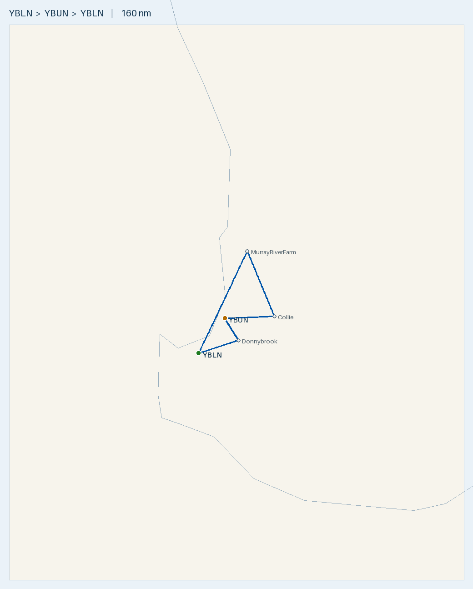

# Plan — Busselton SW day loop (Murray River Farm · Collie · Bunbury)

**Route (single-day loop, land back at Busselton):**
- YBLN → **Murray River Farm** (Coolup) → **Collie** → **YBUN Bunbury** → *overfly Donnybrook* → YBLN
- **Landings:** YBLN, Murray River Farm, Collie, Bunbury, YBLN. **Donnybrook is a visual waypoint only** (turning point on the leg home — no landing).

**Aircraft:** 1 × [Tecnam P2002 Sierra](../../aircraft/P2002.md) · Rotax 912 ULS · MTOW **600 kg** · 99 L usable
**Planning basis:** Wind **080°T / 12 kt** (assumed constant) · Cruise 100 KTAS · Burn **20 L/hr** (conservative; POH ~15–18) · **final reserve 10 L (30 min, day VFR)** · variation **2°W**
**Loading:** occupants **170 kg** + cargo **2 kg** = **172 kg** · empty weight **365 kg** (assumed)
**Data source:** ERSA FAC/RDS effective **09 JUL 2026** for YBLN/YBUN. **Murray River Farm and Collie are private/unlisted ALAs — not in ERSA** (details from the operator / Country Airstrips; verify on the day). **Donnybrook is overflown only.**

> ✈️ **Bottom line:** This is a ~**160 nm, ~1 h 37 m** scenic loop that never leaves the SW corner. **One Mogas fill at Busselton
> does the whole day** — the loop burns only ~32 L. **The catch is weight, not range:** at **365 kg empty** + 2 pax you're
> MTOW-limited to ~87 L, so **don't brim the tanks** — plan **~65 L** (lands ~33 L, 16 kg under 600 kg). **There is no fuel
> anywhere on the loop** (Collie and Murray River Farm have none; Bunbury is AVGAS-only).
> The two private landing strips (**Murray River Farm, Collie**) are **PPR / courtesy-call jobs — confirm surface, length,
> condition and circuit with each operator before you go.** **Donnybrook is just an overflown turning point (no landing).**
> **Watch the shared CTAF: Busselton and Bunbury are both
> on 127.0** and only ~20 nm apart, so listen out and call clearly for each.

---

## Route Summary — leg-by-leg nav log

Wind **080°/12 kt** constant · TAS 100 kt · 20 L/hr · var 2°W. **HDG columns are wind-corrected**; fuel-left assumes departing YBLN with **65 L** (the MTOW-safe planning load — see W&B; you **can't** brim the tanks at 365 kg empty).

| Leg | Segment | Dist (nm) | Track °T | HDG °T / °M | GS (kt) | Time | Leg fuel (L) | Cum. time | Fuel left (L) |
|:---:|---------|----------:|:--------:|:-----------:|--------:|-----:|-------------:|----------:|--------------:|
| 1 | YBLN → Murray River Farm | 60.1 | 026 | 032 / 034 | 92 | 39 m | 13.0 | 39 m | 52 |
| 2 | Murray River Farm → Collie | 37.5 | 157 | 150 / 152 | 97 | 23 m | 7.8 | 62 m | 44 |
| 3 | Collie → YBUN Bunbury | 26.3 | 267 | 268 / 270 | 112 | 14 m | 4.7 | 76 m | 40 |
| 4a | YBUN Bunbury → Donnybrook *(overfly)* | 13.7 | 148 | 142 / 144 | 95 | 9 m | 2.9 | 85 m | 37 |
| 4b | Donnybrook → YBLN | 22.2 | 252 | 251 / 253 | 112 | 12 m | 4.0 | 97 m | 33 |
| **—** | **Loop total** | **160** | — | — | — | **~1 h 37 m** | **~32** | — | **~33** |

- **Landings** at YBLN, Murray River Farm, Collie, Bunbury, YBLN. **Donnybrook (leg 4a→4b) is overflown only** — a visual turning point, no landing.
- **The loop nearly cancels the wind:** the NE outbound leg 1 loses GS to a quartering headwind (**92 kt**), the westerly return legs 3 & 4b get it back (**112 kt**), so the total (**~1 h 37 m / ~32 L**) is within a minute/litre of nil-wind.
- **Wind favours the into-wind runway everywhere:** YBLN **03** (~9 kt xw), Murray River Farm **09** (~2 kt), Collie **10** (~4 kt), Bunbury **07** (~2 kt) — all light crosswinds. Confirm the active runway on CTAF.
- All WA (AWST) — no timezone change. **No fuel on the loop.** Departing YBLN with ~65 L, lands back **~33 L** — **+23 L over the 10 L reserve**. Range is never the constraint here; **MTOW is** (see W&B).

## Fuel plan — one Busselton Mogas fill does the loop

| Point | Fuel type | State | Next leg | Land with (080°/12 kt) | Over 30-min reserve (10 L) |
|-------|-----------|------:|----------|---------------------:|---------------------------:|
| YBLN depart | **Mogas (aeroclub)** | **~65 L** (MTOW-limited) | whole 160 nm loop | **~33 L** back at YBLN | **+23 L** |

- **Range is a non-issue** — the whole day burns ~32 L. Even a 25 kt headwind still lands well over reserve. No top-up needed.
- **You can't brim the tanks.** At **365 kg empty** + 2 pax + 2 kg cargo, full 99 L puts you **8 kg over MTOW** — max legal fuel is
  **~87 L**. Plan **~65 L**: covers the loop + reserve with margin and keeps you **16 kg under 600 kg** (and lighter off the private strips).
- **No Mogas anywhere on the loop.** If you ever needed fuel, **Bunbury (YBUN) has an H24 AVGAS card bowser** (AIR BP; Jet A1
  **not** available) — the 912 ULS runs on 100LL fine. Collie and Murray River Farm have **no fuel**.

## Weight & Balance (empty **365 kg**; occupants 170 + cargo 2)

| Item | Mass (kg) | Arm (in) | Moment (kg·in) |
|------|----------:|---------:|---------------:|
| Empty (assumed) | 365 | ~67.8 | 24,747 |
| Occupants | 170 | 70.86 | 12,046 |
| Cargo | 2 | 86.61 | 173 |
| **Zero-fuel** | **537** | **68.84** | **36,966** |
| + Planning fuel ~65 L | 47 | 60.23 | 2,807 |
| **Takeoff (~65 L)** | **584** | **68.2** | **39,773** |

- **584 kg < 600 MTOW ✓** (16 kg margin); CoG 68.2 in, inside 63.4–70.4 ✓. **MTOW is the binding limit here, not CoG or range.**
- **Full fuel (99 L) = 608 kg — 8 kg OVER MTOW ❌.** Zero-fuel is already 537 kg, so **max fuel is ~63 kg ≈ 87 L** before you hit 600 kg.
- The loop needs only ~32 L + 10 L reserve, so **~65 L is the sensible load** — lands ~33 L, stays 16 kg under MTOW, and is lighter
  off the private strips. Add fuel toward the ~87 L ceiling only if you want more reserve; **never brim it at this empty weight.**
- Empty **arm** assumed ~67.8 in (planning). **Confirm the real empty weight AND arm** from this airframe's Weight & Balance Record.

## Route Map

- 🗺️ **[Interactive: `map.geojson`](map.geojson)** · 🌐 **[Great Circle Mapper](https://www.gcmap.com/mapui?P=YBLN-YMUL-YBUN-YBLN)** (YMUL/Murray Field ≈ Murray River Farm)
- Regenerate: `.venv/bin/python scripts/route_map.py map YBLN "MurrayRiverFarm@-32.7838,115.9145" "Collie@-33.3597,116.2012" YBUN "Donnybrook@-33.571,115.822" YBLN --out flightplans/P2002/YBLN-southwest-loop`

## Density altitude
- Field elevations are low (**Collie 795 ft**, the rest < 100 ft), so DA is a minor factor — but late-September afternoons
  still warm up. On the two private strips prefer a **cool-of-the-day departure** and **check TODR** for the 98 hp Rotax,
  especially near MTOW. All strips here are long (≥1000 m sealed/asphalt) so the roll is not marginal for a P2002.

---

## Aerodromes

| Aerodrome | Role | Position | Elev | Runway (surface, length) | Fuel | CTAF / freq | Key notes |
|-----------|------|----------|-----:|--------------------------|------|-------------|-----------|
| **[YBLN](../../aerodromes/YBLN.md) Busselton** *(CERT)* | Depart & return (home) | -33.687, 115.400 | 56 ft | 03/21 grooved, 2460 × 45 m | AVGAS · Jet A1 · **aeroclub Mogas** | **CTAF 127.0** · FIA 124.9 | Fill Mogas here. Shares 127.0 with Bunbury |
| **Murray River Farm** *(private, not in ERSA)* | Stop 1 | -32.7871, 115.9114 | ~90 ft | 09/27 asphalt, 1000 m | **None** | *(private — nil published)* | **PPR essential** — confirm condition/circuit with owner |
| **Collie (YCOI)** *(ALA, not in ERSA)* | Stop 2 | -33.360, 116.201 | 795 ft | 10/28 sealed, 1150 m | **None** | PAL **122.3** · area 124.9 | **Caution tall trees**; Shire-run, courtesy call; no landing fee/ASIC |
| **[YBUN](../../aerodromes/YBUN.md) Bunbury** *(CERT)* | Stop 3 (last before home) | -33.378, 115.677 | 53 ft | 07/25 sealed, 18 m wide (07 TORA 1015 m / 25 TORA 1219 m) | **AVGAS only** (Jet A1 N/A, no Mogas) | **CTAF 127.0** · FIA 124.9 | AVGAS card-bowser backstop. Shares 127.0 with Busselton |
| **Donnybrook** *(unlisted)* | Overfly waypoint | ~-33.571, 115.822 | — | — (no landing) | — | — | Visual turning point on leg home; not in ERSA/Country Airstrips |

### [YBLN](../../aerodromes/YBLN.md) — Busselton (WA) — HOME BASE (depart & return)
- -33.687, 115.400 · Elev 56 ft · **CERT** · AVGAS + Jet A1 (+ **aeroclub Mogas** — off-book, arrange with the club) · **CTAF 127.0** · FIA 124.9
- **RWY 03/21 grooved, 2460 m, 45 m wide.** Fill Mogas here before the loop.

### Murray River Farm (Coolup, WA) — STOP 1 — **PRIVATE STRIP, not in ERSA**
- **-32.7871, 115.9114** · **Elev ~90 ft** (DEM; ~28 m) · **RWY 09/27, 1000 m, asphalt** · **No fuel**
- **PRIVATE — PPR essential.** Confirm current condition, circuit direction, obstacles and access with the owner before
  arrival. ~1000 m asphalt is generous for a P2002. Nearest listed diversion: **Murray Field (YMUL, AVGAS) ~17 nm NW**.

### Collie (WA) — STOP 2 — **ALA (YCOI), not in ERSA FAC**
- **-33.360, 116.201** (33°21.58′S 116°12.07′E) · **Elev 795 ft** · **RWY 10/28, 1150 m, sealed** · **No fuel** · No landing fee, no ASIC
- **PAL 122.3** (pilot-activated lighting) · area/FIA 124.9 · windsocks at both thresholds · **CAUTION: tall trees** near the strip.
- 2 nm from Collie town. Shire-operated — courtesy call advisable: **Collie Shire (08) 9734 9000 / 0408 250 048**. Public
  toilets on field. *(Details: Country Airstrips Australia — verify currency before flight.)*

### [YBUN](../../aerodromes/YBUN.md) — Bunbury (WA) — STOP 3 (final landing before home)
- -33.378, 115.677 · Elev 53 ft · **CERT** · **AVGAS only** (AIR BP H24 card bowser; **Jet A1 not available**, no Mogas) · **CTAF 127.0** · FIA 124.9
- **RWY 07/25 sealed, 18 m wide** — declared: 07 TORA 1015 m / 25 TORA 1219 m. AVGAS backstop for the loop if ever needed.
- ⚠️ **Shares CTAF 127.0 with Busselton (~20 nm away)** — monitor both, use full position calls including the field name.

### Donnybrook (WA) — WAYPOINT ONLY (overfly on the leg home, no landing)
- Approx **-33.571, 115.822** (town) · Used purely as a **visual turning point** ~14 nm SE of Bunbury en route to YBLN.
- No landing planned, so no strip/PPR detail needed. If you later want to land here, the strip isn't in ERSA or Country
  Airstrips — you'd have to source position/surface/PPR from the operator first.

## Pre-Flight Checks
- [ ] **PPR / courtesy calls:** Murray River Farm (owner), Collie (Shire). *(Donnybrook is overfly-only — no call needed.)*
- [ ] **Confirm Murray River Farm** surface/condition (asphalt 09/27, ~1000 m) and **Collie** (sealed 10/28, 1150 m, PAL 122.3, tall trees).
- [ ] **Busselton Mogas** arranged and filled (aeroclub, off-book). No fuel on the loop; Bunbury AVGAS is the only en-route backstop.
- [ ] **W&B on the day** against real empty weight/arm — at **365 kg empty** + 2 pax, **max fuel ~87 L** (full 99 L is over MTOW); plan ~65 L, cargo ~2 kg.
- [ ] **Radio:** Busselton **and** Bunbury both on **CTAF 127.0** — full position/field-name calls; Collie PAL 122.3, area 124.9.
- [ ] Current ERSA + **NOTAMs** for YBLN/YBUN; weather/wind; **TODR** check for the private strips near MTOW on a warm afternoon.
