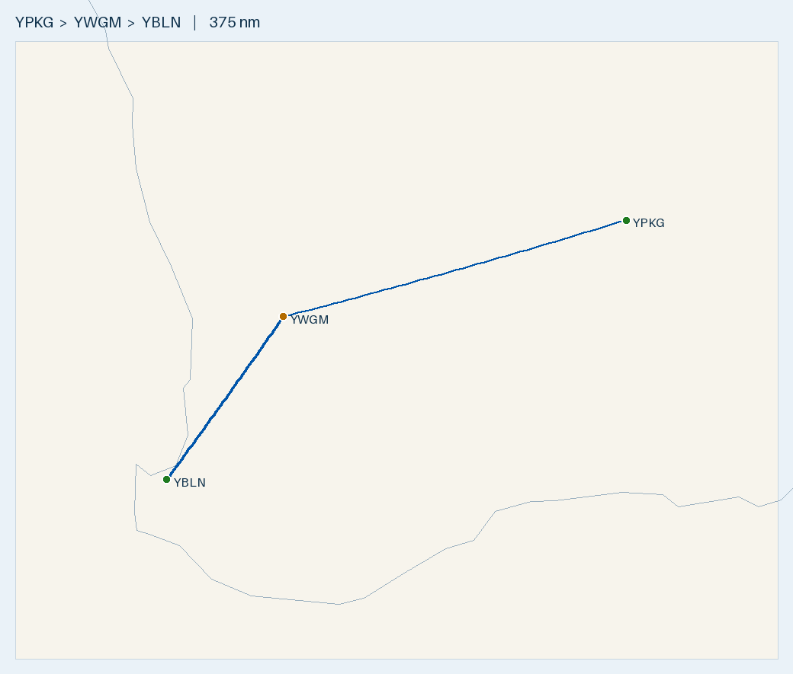

# Plan 2 — Kalgoorlie → Busselton return via White Gum (1-day)

**Route (1-day, White Gum fuel · Northam YNTM the alternate):** **YPKG → YWGM → YBLN**
· **YPKG→YWGM 241 nm (~253°T)** then **YWGM→YBLN 134 nm (~216°T)**
**Aircraft:** [Tecnam P2002 Sierra](../../aircraft/P2002.md) · Rotax 912 ULS · MTOW **600 kg** · 99 L usable
**Planning basis:** No wind · Cruise 100 KTAS · Burn **20 L/hr** (conservative; POH ~15–18) · **final reserve 10 L (30 min, day VFR)**
**Loading:** occupants **170 kg** + cargo **20 kg** = **190 kg** · **full fuel at each fuelled departure**
**Data source:** ERSA FAC/RDS effective **09 JUL 2026** — verify against current ERSA + NOTAMs on the day.

> ✈️ **Bottom line:** The straight run home — **375 nm in two full-tank legs**, split at **White Gum** for a Mogas top-up,
> with **Northam (YNTM, 19 nm) as the alternate** if the bowser's dry. Both legs land with plenty (nil-wind ~49 L at White
> Gum, ~70 L at Busselton), so wind is not a range concern. Only the first leg (out of Kalgoorlie) runs on AVGAS; the leg
> home from White Gum is Mogas.

---

## Route Summary

| Leg | From → To | Distance | Track | Time @ 100 kt | Trip fuel (L) |
|-----|-----------|---------:|------:|--------------:|--------------:|
| 1 | YPKG → YWGM | 241 nm | ~253°T | 2 h 24 m | ~50 |
| 2 | YWGM → YBLN | 134 nm | ~216°T | 1 h 20 m | ~29 |
| **Total** | **YPKG → YBLN** | **375 nm** | | **~3 h 44 m** | |

- One WA day (AWST) — no timezone change. Longest leg 241 nm (~2.4 h), well inside the ~5 h full-tank endurance.

## Fuel plan — top up Mogas at White Gum (Northam the alternate)

| Departure | Fuel type | Depart | Leg | Land with (nil wind) | Over 30-min reserve (10 L) |
|-----------|-----------|-------:|-----|---------------------:|---------------------------:|
| YPKG | AVGAS 100LL | 99 L | → YWGM 241 nm | **~49 L** | **+39 L** |
| YWGM | **Mogas (bowser)** | 99 L | → YBLN 134 nm | ~70 L | +60 L |

- **Wind is not a range issue** — both legs depart full; the 241 nm leg still lands ~33 L even in a 25 kt headwind.
- **⛽ Alternate if White Gum is dry → Northam (YNTM), 19 nm WNW** — sealed 14/32 (1248 m), **AVGAS H24 credit-card
  bowser**, no PPR. You reach White Gum with ~49 L, so the diversion costs ~4 L. AVGAS not Mogas, but the 912 runs on it.
- **Fuel type:** only the Kalgoorlie→White Gum leg is AVGAS; the leg home is Mogas (the 912's preferred fuel).

## Weight & Balance — full fuel + 190 kg (planning empty 330 kg)

| Item | Mass (kg) | Arm (in) | Moment (kg·in) |
|------|----------:|---------:|---------------:|
| Empty (planning) | 330 | ~67.8 | 22,374 |
| Occupants | 170 | 70.86 | 12,046 |
| Cargo | 20 | 86.61 | 1,732 |
| Full fuel (99 L) | 71 | 60.23 | 4,276 |
| **Takeoff** | **591** | **68.4** | **40,429** |

- **591 kg < 600 MTOW ✓** (9 kg margin); CoG 68.4 in full → 69.5 in dry, inside 63.4–70.4 ✓.
- Valid **only if empty ≤ 339 kg** — at the POH-sample 339.7 kg you'd be ~1 kg over, so carry ~2 L less or trim cargo.
- **In the heavier 355 kg airframe**, full fuel + 170 kg pax leaves only ~4 kg for cargo under MTOW — cap fuel at ~76 L to
  carry the full 20 kg (still ample for these legs), i.e. **full fuel *or* meaningful cargo, not both**.

## Route Map

- 🗺️ **[Interactive: `map.geojson`](map.geojson)** · 🌐 **[Great Circle Mapper](https://www.gcmap.com/mapui?P=YPKG-YWGM-YBLN)**
- Regenerate: `.venv/bin/python scripts/route_map.py map YPKG YWGM YBLN --out flightplans/P2002/YPKG-YBLN`

## Density altitude
- **Kalgoorlie 1203 ft, White Gum 1000 ft** — warm-day density altitude climbs well above these; the 98 hp Rotax loses
  climb and lengthens the roll. **Check TODR**, prefer early-morning departures near MTOW.

---

## Aerodromes

### [YPKG](../../aerodromes/YPKG.md) — Kalgoorlie-Boulder (WA) — DEPART
- -30.789, 121.462 · Elev 1203 ft · AVGAS + Jet A1 + F34 (**no Mogas**) · CTAF/UNICOM 126.6 · RWY 11/29 2000 m sealed; 18/36 1200 m · **H24 AVGAS card bowser** (Carnet/credit)

### [YWGM](../../aerodromes/YWGM.md) — White Gum (WA) — FUEL STOP (Mogas)
- -31.867, 116.939 · Elev 1000 ft · **UNCR, private — PPR** · CTAF 126.7 · **MOGAS bowser** (TWY east of RWY 14/32)
- **RWY 14/32 1400 m SAND; 09/27 750 m gravel** (ample) · confirm PPR + Mogas ahead.

### [YNTM](../../aerodromes/YNTM.md) — Northam (WA) — FUEL ALTERNATE (if White Gum dry)
- -31.626, 116.684 · Elev 500 ft · **UNCR** · CTAF 124.2 · **AVGAS H24 credit-card bowser** (no Jet A1) · RWY 14/32 1248 m sealed · **~19 nm WNW of White Gum**

### [YBLN](../../aerodromes/YBLN.md) — Busselton (WA) — HOME BASE
- -33.687, 115.400 · Elev 56 ft · AVGAS + Jet A1 (+ **aeroclub Mogas**) · CTAF 127.0 · RWY 03/21 grooved, 2460 m, 45 m wide

## Pre-Flight Checks
- [ ] **PPR + Mogas confirmed at White Gum**; if unavailable, divert to **Northam (YNTM, ~19 nm)**.
- [ ] **W&B** against real empty weight — full fuel + 190 kg ≤ 600 kg needs empty ≤ 339 kg (591 planned); cargo ≤ 20 kg.
- [ ] Kalgoorlie AVGAS to full before departure; Carnet/credit carried. White Gum Mogas to full for the leg home.
- [ ] Density altitude / TODR for Kalgoorlie (1203 ft) & White Gum (1000 ft); cool-of-day departures near MTOW.
- [ ] ARFOR/TAFs + NOTAMs for YPKG, YWGM, YNTM, YBLN; crosswind ≤ 22 kt demonstrated; water + PLB on the inland legs.

---
*Planning only. Cross-check current ERSA, NOTAMs, weather, W&B and the P2002 Flight Manual before flight.*
