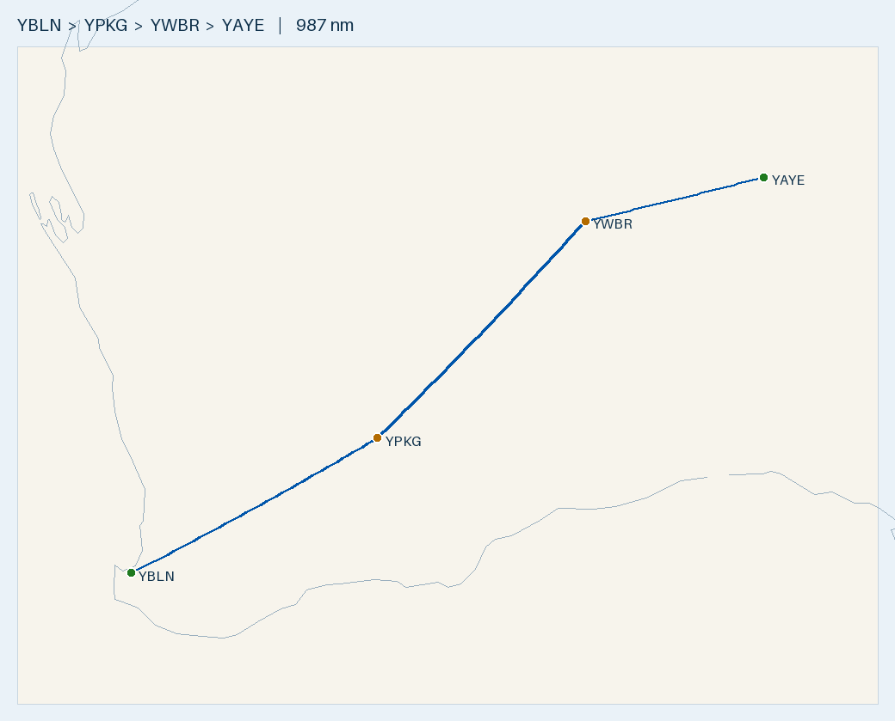

# Flight Plan — YBLN → YAYE (Cirrus SR20, AVGAS)

**Route:** Busselton (YBLN) → Kalgoorlie-Boulder (YPKG) → Warburton (YWBR) → Ayers Rock/Connellan (YAYE)
**Aircraft:** Cirrus SR20 (G2) · Fuel: AVGAS · Safe cruise range: 600 nm
**Planning basis:** No wind · Cruise 150 KTAS · Burn **12.5 USG/hr** (safe planning; ~11.6 book cruise) · 1 USG = 3.785 L
**Data source:** ERSA FAC/RDS effective **09 JUL 2026** — verify against current ERSA + NOTAMs on the day.

---

## Route Summary

| Leg | From → To | Distance | Time @ 150 kt | Fuel @ 12.5 GPH (USG) | Fuel (L) | Cost @ $3.00/L |
|-----|-----------|---------:|--------------:|----------------------:|---------:|---------------:|
| 1 | YBLN → YPKG | 353 nm | 2 h 21 m | 29.4 | 111 L | $334 |
| 2 | YPKG → YWBR | 389 nm | 2 h 36 m | 32.4 | 123 L | $368 |
| 3 | YWBR → YAYE | 244 nm | 1 h 38 m | 20.3 | 77 L | $231 |
| **Total** | | **986 nm** | **6 h 34 m** | **82.2** | **311 L** | **~$933 AUD** |

- Fuel figures use **12.5 GPH** (safe planning). At book cruise 11.6 GPH the trip is ~76 USG / ~$866.
- Direct YBLN→YAYE great-circle distance: **959 nm** (one stop minimum; this route uses two).
- Longest leg 389 nm ≈ **65% of the 600 nm safe range** — healthy margin.
- Figures are cruise time only; add ~1 USG/leg taxi on top of the 12.5 GPH margin when uplifting.
- **Fuel cost is price-sensitive:** regional AVGAS ~$2.80–$3.50/L; remote strips (Warburton) often higher.
  At $3.50/L ≈ $970; at $4.00/L ≈ $1,110.

---

## Route Map

- 🗺️ **[Interactive version: `maps/YBLN-YAYE.geojson`](maps/YBLN-YAYE.geojson)** — GitHub renders this as a pan/zoom Leaflet map; click legs/markers for distances and fuel.
- 🌐 **[Great Circle Mapper view](https://www.gcmap.com/mapui?P=YBLN-YPKG-YWBR-YAYE)** — quick browser preview.
- Regenerate: `.venv/bin/python scripts/route_map.py YBLN-YAYE YBLN YPKG YWBR YAYE`

---

## Aerodromes

### [YBLN](aerodromes/YBLN.md) — Busselton (WA) — DEPARTURE
- Position: -33.687, 115.400 · AVGAS + Jet A1

### [YPKG](aerodromes/YPKG.md) — Kalgoorlie-Boulder (WA) — FUEL STOP 1
- Position: -30.789, 121.462 · Elev 1203 ft · AVGAS + Jet A1 + F34
- RWY 11/29: TORA 2000 m, sealed, WID 45 m, 0.8% down to E
- RWY 18/36: TORA 1200 m, WID 18 m
- Major regional airport — reliable fuel and services.

### [YWBR](aerodromes/YWBR.md) — Warburton (WA) — FUEL STOP 2
- Position: -26.128, 126.583 · Elev 1510 ft · AVGAS + Jet A1
- RWY 18/36: TORA 1590 m, TODA 1650 m, LDA 1590 m, WID 23 m, 0.2% down to S
- Lighting: LIRL + PAL 119.65 · standby power available
- Remote Indigenous-community aerodrome — **PPR / permit + fuel-availability phone call required in advance.**
- Surface: sealed (confirm on current ERSA).

### [YAYE](aerodromes/YAYE.md) — Ayers Rock / Connellan (NT) — ARRIVAL
- Position: -25.186, 130.976 · AVGAS + Jet A1

---

## Fuel Cards & Payment

| Stop | AVGAS provider | Card needed | Notes |
|------|---------------|-------------|-------|
| YBLN Busselton | Air BP / City | ⚠️ **Air BP Carnet ONLY** | Phone aerodrome operator |
| YPKG Kalgoorlie | Air BP/Mobil | **BP card** (H24 AVGAS card bowser) | |
| YWBR Warburton | (via ARO) | ⚠️ **4 hr PN — phone ARO**; confirm payment when booking | AH call-out fee |
| YAYE Ayers Rock | Skyfuel/Viva/BP | **Visa/MC, Fuel2Sky or BP card** | AVGAS card-swipe bowser |

**Carry: an Air BP Carnet** (Busselton is carnet-only) **+ a Visa/Mastercard + BP card** (covers Kalgoorlie and Ayers Rock). **Warburton: phone the ARO 4 hr ahead** to arrange fuel and confirm accepted payment. *(Source: ERSA 09JUL2026 handling section — confirm on current ERSA.)*

## Pre-Flight Checks (in advance)

### Fuel & aircraft
- [ ] Confirm AVGAS actually available and open at **YWBR (Warburton)** and **YPKG** — phone ahead.
- [ ] Get actual AVGAS price/L at each stop to firm up the ~$831 estimate.
- [ ] Confirm SR20 usable fuel (~56–60 USG) covers each leg + reserves (each leg ≤ 29 USG).
- [ ] Fixed reserve: min 45 min at normal cruise burn (~9 USG) on top of trip fuel.
- [ ] W&B within limits with full/partial fuel loads at each departure.

### Permissions & access
- [ ] **Warburton (YWBR): PPR / landing permit** — remote community; arrange in advance.
- [ ] Landing fees / prior notice for YPKG and YAYE (Ayers Rock is a busy RPT aerodrome — check slots/PPR).
- [ ] Carriage/customs N/A (domestic), but confirm any aerodrome-specific access rules.

### Weather & NOTAMs (day of flight)
- [ ] Area forecast (ARFOR) + TAFs for YBLN, YPKG, YWBR, YAYE.
- [ ] NOTAMs for all four aerodromes + en-route (long remote legs over sparse terrain).
- [ ] Actual wind — recompute leg times/fuel if significant headwind (esp. Leg 2).
- [ ] Density altitude: YWBR elev 1510 ft + summer temps → check takeoff/landing performance.

### Navigation & documents
- [ ] Current ERSA/AIP — re-verify YWBR runway surface & length, and all fuel entries.
- [ ] VNC/WAC charts and GPS database current.
- [ ] Flight notes / SARTIME plan submitted (long remote legs — flight following recommended).
- [ ] Nearest alternates identified for each leg (sparse AVGAS network out here).

### Safety / remote-ops
- [ ] Survival equipment appropriate to remote terrain (water, PLB/EPIRB, comms).
- [ ] HF or sat comms consideration on remote legs where VHF coverage is poor.
- [ ] Endurance/reserve double-check before committing to the YPKG→YWBR leg (389 nm, most remote).

---

## Alternative (1 stop, tight — NOT recommended)
YBLN → **[YLEO](aerodromes/YLEO.md) Leonora** (419 nm) → YAYE (**562 nm**). Final leg is ~94% of the 600 nm safe range — no
allowance for wind/reserves. Only viable near-nil wind with full tanks. Leonora: sealed RWY 04/22 TORA 2018 m, AVGAS + Jet A1.

---

*Generated for planning only. Always cross-check current ERSA, NOTAMs, weather, and the SR20 POH before flight.*
