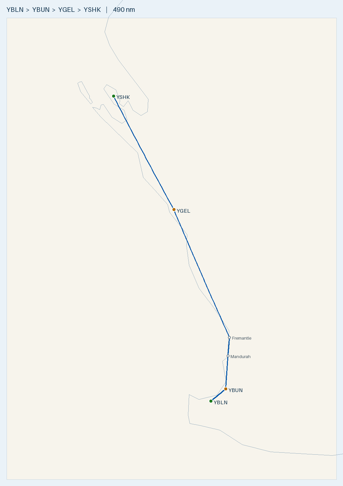

# Flight Plan — YBLN → YSHK (Cirrus SR20, AVGAS)

**Route:** Busselton (YBLN) → Bunbury (YBUN) → *Mandurah* → *Fremantle* → Geraldton (YGEL) → Shark Bay / Denham (YSHK)
**Aircraft:** Cirrus SR20 (G2) · Fuel: AVGAS · Safe cruise range: 600 nm
**Planning basis:** No wind · Cruise 150 KTAS · Burn **12.5 USG/hr** (safe planning; ~11.6 book cruise) · 1 USG = 3.785 L · **VFR coastal tracking**
**Data source:** ERSA FAC/RDS effective **09 JUL 2026** — verify against current ERSA + NOTAMs on the day.

> 🛩️ **COASTAL ROUTE — no overwater.** Track the coastline the whole way. Route via **Bunbury (YBUN)**
> around the eastern shore of Geographe Bay (avoids cutting across open water), then **Mandurah** and
> **Fremantle** as visual nav waypoints en route to Geraldton, then continue up the coast to Shark Bay.
>
> ⚠️ **KEY POINT — no fuel at destination.** YSHK (Shark Bay) has **NO AVGAS**. Plan to arrive with
> ample fuel and a firm onward/return fuel plan. **Nearest AVGAS is Carnarvon (YCAR), 61 nm north.**

---

## Route Summary

| Leg | From → To | Distance | Time @ 150 kt | Fuel @ 12.5 GPH (USG) | Fuel (L) | Cost @ $3.00/L |
|-----|-----------|---------:|--------------:|----------------------:|---------:|---------------:|
| 1 | YBLN → YBUN → Mandurah → Fremantle → YGEL | 306 nm | 2 h 02 m | 25.5 | 96 L | $289 |
| 2 | YGEL → YSHK (coastal) | 184 nm | 1 h 14 m | 15.4 | 58 L | $174 |
| **Total** | | **490 nm** | **3 h 16 m** | **40.8** | **155 L** | **~$464 AUD** |

- Fuel figures use **12.5 GPH** (safe planning). At book cruise 11.6 GPH the trip is ~38 USG / ~$430.
- Coastal tracking via Bunbury/Mandurah/Fremantle adds only **~10 nm** vs the direct 296 nm — negligible.
- Direct YBLN→YSHK great-circle distance: **477 nm** — within the 600 nm range nonstop, **but** see notes.
- Longest leg 306 nm ≈ **51% of the 600 nm safe range** — very comfortable.
- Figures are cruise time only; add ~1 USG/leg taxi on top of the 12.5 GPH margin when uplifting.
- Fuel cost is price-sensitive: regional AVGAS ~$2.80–$3.50/L. At $3.50/L ≈ $478.

### Coastal Nav Waypoints (Leg 1)
| Waypoint | Approx position | Notes |
|----------|-----------------|-------|
| YBLN Busselton | -33.687, 115.400 | Depart, track E/NE around Geographe Bay shore |
| **YBUN Bunbury** | -33.378, 115.677 | Aerodrome at head of Geographe Bay — keeps the track over land (AVGAS available; handy alternate) |
| **Mandurah** | ~-32.53, 115.72 | Coastal town, visual waypoint |
| **Fremantle** | ~-32.06, 115.75 | Port/river mouth, visual waypoint |
| YGEL Geraldton | -28.796, 114.707 | Fuel stop |

> ⚠️ **Perth controlled airspace.** The coastal track past **Fremantle** runs directly through the
> **Perth (YPPH) Class C / Jandakot (YPJT) Class D** control zones and coastal VFR corridor. Plan to either:
> use the **published Perth VFR coastal route** with an airways clearance and the standard coastal reporting
> points, or route slightly west/inland to remain OCTA — brief this before departure and have the current
> Perth VTC/VNC chart. Monitor/obtain clearance as required.

### Why stop at Geraldton rather than fly direct?
Direct (477 nm) is *within* range, but YSHK has **no fuel**, so flying direct would leave you at Shark Bay
with little margin and no way to refuel. Topping up at **YGEL** means you land at YSHK with near-full tanks —
enough for the 61 nm hop to Carnarvon (or 184 nm back to Geraldton) **plus reserves**.

---

## Route Map

- 🗺️ **[Interactive version: `maps/YBLN-YSHK.geojson`](maps/YBLN-YSHK.geojson)** — GitHub renders this as a pan/zoom Leaflet map; click legs/markers for distances and fuel.
- 🌐 **[Great Circle Mapper view](https://www.gcmap.com/mapui?P=YBLN-YBUN-YGEL-YSHK)** — quick browser preview.
- Map shows the flown legs YBLN→**YBUN**→**Mandurah**→**Fremantle**→YGEL→YSHK; YBUN keeps the track around Geographe Bay over land, and Mandurah & Fremantle are the coastal visual waypoints (small hollow markers). Total reflects the ~10 nm coastal detour (490 nm).
- Regenerate: `.venv/bin/python scripts/route_map.py YBLN-YSHK YBLN YBUN Mandurah@-32.53,115.72 Fremantle@-32.06,115.75 YGEL YSHK`

---

## Aerodromes

### [YBLN](aerodromes/YBLN.md) — Busselton (WA) — DEPARTURE
- Position: -33.687, 115.400 · Elev 56 ft · AVGAS + Jet A1

### [YGEL](aerodromes/YGEL.md) — Geraldton (WA) — FUEL STOP
- Position: -28.796, 114.707 · Elev 122 ft · AVGAS + Jet A1
- RWY 03/21: TORA 2389 m, **Grooved (sealed)**, WID 45 m, 0.3% down to S
- RWY 08/26: TORA 900 m, Gravel · RWY 14/32: TORA 844 m
- Full regional airport — reliable fuel and services.

### [YSHK](aerodromes/YSHK.md) — Shark Bay / Denham (WA) — DESTINATION (NO FUEL)
- Position: -25.894, 113.577 · Elev 129 ft · **NO FUEL AVAILABLE**
- RWY 18/36: TORA 1690 m, TODA 1750 m, LDA 1690 m, WID 30 m
- Confirm surface on current ERSA.

### [YCAR](aerodromes/YCAR.md) — Carnarvon (WA) — NEAREST AVGAS TO DESTINATION (onward/return)
- Position: -24.881, 113.672 · Elev 13 ft · AVGAS + Jet A1 · **61 nm N of YSHK (~25 min)**
- RWY 04/22: TORA 1619 m · RWY 18/36: TORA 1140 m

---

## Fuel Cards & Payment

| Stop | AVGAS provider | Card needed | Notes |
|------|---------------|-------------|-------|
| YBLN Busselton | Air BP / City | ⚠️ **Air BP Carnet ONLY** | Phone aerodrome operator |
| YGEL Geraldton | World Fuel Services | **WFS cardswipe / credit card** | H24; **30 min PN** bus. hrs |
| YSHK Shark Bay | — | ❌ **NO FUEL** | carry enough to reach Carnarvon + reserve |
| YCAR Carnarvon | WFS / Air BP | **Credit card (WFS app)** or **BP card** | H24 bowsers |

**Carry: an Air BP Carnet** (Busselton is carnet-only) **+ a Visa/Mastercard** (Geraldton/Carnarvon) **+ BP card** (Carnarvon Air BP). Remember **Shark Bay has no fuel** — Carnarvon (61 nm N) is your refuel. Geraldton/Carnarvon want PN; expect AH call-out fees — phone ahead. *(Source: ERSA 09JUL2026 handling section — confirm on current ERSA.)*

## Pre-Flight Checks (in advance)

### Fuel & aircraft — CRITICAL (no fuel at destination)
- [ ] **Confirm onward/return fuel plan** — YSHK has no AVGAS. Land with enough to reach **YCAR (61 nm)** or
      **YGEL (184 nm)** plus reserves. Ideally arrive near-full from Geraldton.
- [ ] Confirm AVGAS available and open at **YGEL** (and **YCAR** for the onward leg) — phone ahead.
- [ ] Get actual AVGAS price/L at each stop to firm up the ~$404 estimate.
- [ ] Fixed reserve: min 45 min at normal cruise burn (~9 USG) on top of trip fuel.
- [ ] W&B within limits at each departure fuel load.

### Permissions & access
- [ ] Landing fees / PPR for YGEL, YSHK, YCAR as applicable.
- [ ] Shark Bay is within/near the **Shark Bay World Heritage Area** — check any local ops/noise/wildlife notices.

### Weather & NOTAMs (day of flight)
- [ ] Area forecast (ARFOR) + TAFs for YBLN, YGEL, YSHK, YCAR.
- [ ] NOTAMs for all aerodromes + en-route (coastal WA).
- [ ] Actual wind — recompute leg times/fuel if significant head/tailwind.
- [ ] Coastal sea-breeze / crosswind at YSHK (single RWY 18/36) — check limits.

### Navigation & documents
- [ ] Current ERSA/AIP — re-verify YSHK runway surface, and fuel entries at all stops.
- [ ] **Perth VTC + VNC/WAC charts** current — brief the **Perth/Jandakot coastal VFR route** and reporting
      points, or plan an OCTA track. Decide clearance vs. OCTA before departure.
- [ ] Coastal tracking confirmed for the whole route (no overwater segments) — Mandurah & Fremantle as
      visual waypoints on Leg 1; follow the coast Geraldton → Shark Bay on Leg 2.
- [ ] GPS database current; load Mandurah/Fremantle as user waypoints if not in database.
- [ ] Flight notes / SARTIME plan submitted (coastal remote legs — flight following recommended).
- [ ] Alternates identified: YGEL/YCAR bracket YSHK for fuel and weather diversions.

### Safety / remote-ops
- [ ] Survival equipment appropriate to remote coastal terrain; PLB/EPIRB.
- [ ] Endurance/reserve double-check before departing YGEL for fuel-less YSHK.

---

## Alternatives
- **Nonstop YBLN → YSHK (477 nm):** within the 600 nm range, but arrives with limited margin at a
  fuel-less aerodrome — only advisable near-nil wind with full tanks **and** a confirmed hop to YCAR.
- **Via Carnarvon:** fly YBLN → YGEL → YCAR (fuel) → YSHK if you'd rather stage fuel as far north as
  possible before the fuel-less destination (adds distance but maximises reserves at YSHK).

---

*Generated for planning only. Always cross-check current ERSA, NOTAMs, weather, and the SR20 POH before flight.*
