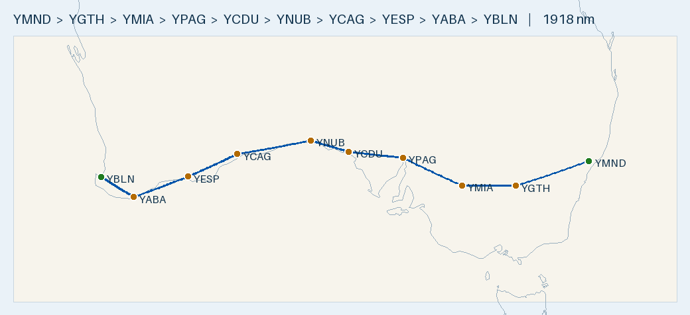

# Flight Plan — YMND → YBLN (Tecnam P2002, MOGAS-priority) · 2-Day Nullarbor Crossing

**Route:** Maitland (YMND) → Griffith (YGTH) *(or Cowra — see Mogas option)* → Mildura (YMIA) → Port Augusta (YPAG) → **Ceduna (YCDU — overnight)** → Nullarbor Roadhouse (YNUB) → Caiguna (YCAG) → Esperance (YESP) → Albany (YABA) → Busselton (YBLN)
**Aircraft:** Tecnam P2002 · Rotax 912 ULS · 100 L usable · 20 L/hr · 100 KTAS
**Planning basis:** No wind · 45-min fixed reserve (15 L) → **85 L usable = 425 nm still-air max**; longest leg 287 nm / 57 L.
**Season:** planned **October 2026** (worst case 1 Oct below; Eastern DST from 4 Oct — before then all standard time).
**Data source:** repo's parsed **ERSA FAC/RDS** database (`data/fac_database.sqlite`) — verify against current ERSA + NOTAMs on the day.

> ✈️ **Overview:** ~1,918 nm, ~19 h 11 m airborne, eight fuel stops, split over two days with an overnight at
> **Ceduna** (roughly the midpoint). Over-land route shadowing the Eyre Highway/rail — no overwater.

- 🗺️ **[Interactive version: `maps/YMND-YBLN.geojson`](maps/YMND-YBLN.geojson)** — GitHub renders this as a pan/zoom Leaflet map; click legs/markers for distances and fuel.
- 🌐 **[Great Circle Mapper](https://www.gcmap.com/mapui?P=YMND-YGTH-YMIA-YPAG-YCDU-YNUB-YCAG-YESP-YABA-YBLN)** — quick browser view of the whole route.
- Map shows the **default (Griffith) routing**; the Cowra Mogas option is an equal-distance swap on the eastern leg (see Day 1).

## Fuel strategy — MOGAS-first to save cost (no crew car)
Take **Mogas only where the pump is at the airfield** (no driving into town). Everywhere else, splash **AVGAS**
off the bowser. Requirement: **Premium 95 RON minimum (98 ideal), ethanol-free** — regular 91 ULP is NOT enough
for the 912 ULS. Rotax prefers Mogas anyway (less lead fouling).

| Stop | Fuel taken | Why |
|------|-----------|-----|
| YMND Maitland (start) | **MOGAS** | Royal Newcastle Aero Club Mogas (trailer, **office hours only** — fuel the evening before for the dawn departure) |
| YGTH Griffith *(default)* | AVGAS | confirmed 24 h bowser; shorter/safer legs |
| YCWR Cowra *(Mogas option)* | Mogas **if confirmed** | **FlyOz bowser truck (Lyn Gray) — NOT in ERSA, unconfirmed;** AVGAS 24 h if no Mogas |
| YMIA Mildura | AVGAS | town bowser |
| YPAG Port Augusta | AVGAS | town bowser |
| YCDU Ceduna (o/night) | AVGAS | town bowser (Air BP carnet) |
| **YNUB Nullarbor Roadhouse** | **MOGAS** | **servo at the strip** — ph 08 8625 6271 |
| **YCAG Caiguna** | **MOGAS** | **roadhouse servo at the strip** — ph 08 9039 3459 |
| YESP Esperance | AVGAS | town bowser (Myrup Mogas a maybe — confirm) |
| YABA Albany | AVGAS | town bowser |
| YBLN Busselton (dest) | **MOGAS** | your aeroclub supply |

Biggest Mogas wins are **Nullarbor & Caiguna** — servo at the strip *and* where remote AVGAS is dearest.
(If you confirm the FlyOz Mogas at Cowra, routing via Cowra keeps you on Mogas out to Mildura, ~485 nm — see Day 1.)
Carry an **Air BP Carnet** as the AVGAS backstop. Rough saving Mogas vs AVGAS ≈ $350–550 over the trip.
Caveat: jerry-canning at the roadhouses can take 45–60 min (vs 30) and needs ethanol-free 95+ confirmed by phone.

### Mogas redundancy across the Nullarbor (not in ERSA — confirm before relying on)
The Eyre Highway roadhouses run car-petrol bowsers, so Mogas is denser than just the two planned stops
(source: aircraftpilots.com Mogas thread + the community **"Outback Fuel" Google map** by JG3 — check before departure):
- **Border Village** (SA/WA border) — backs up **Nullarbor Roadhouse**.
- **Cocklebiddy** (east) and **Balladonia** (west) — back up **Caiguna**.
These strips are not in the ERSA FAC dataset, so runway length/surface/serviceability are unverified here — **phone ahead.**

### White Gum (YWGM) — the one verified extra Mogas field
ERSA-listed self-serve Mogas bowser (east of RWY 14/32), inland near York (~130 nm from Busselton). Substituting it
for the Albany tail (…→ YWGM → YBLN) would make the WA run Mogas, **but routes through Perth Class C/D airspace** —
rejected here for the simpler, CTA-free Albany south-coast track. Keep as a Mogas alternative if desired.

## Daylight — worst case 1–2 OCT 2026 (shortest days; verify for actual date)
**Standard time everywhere** (Eastern DST starts Sun 4 Oct): AEST +10, ACST +9.5, AWST +8. Flying west lengthens
the usable day. Margins are absolute/UTC (zone-crossing safe):

| Day | Depart (first light) | Arrive | Last light | Elapsed | **Margin** |
|-----|----|----|----|----|----|
| Day 1 Maitland→Ceduna | Maitland **05:09 AEST** | Ceduna ~mid-PM | 19:02 ACST | 9:19 + 1:30 = **10:49** | **+3 h 34 m** |
| Day 2 Ceduna→Busselton | Ceduna **05:49 ACST** | Busselton ~mid-PM | 18:47 AWST | 9:52 + 2:00 = **11:52** | **+2 h 35 m** |

**Day 2 is a genuine full day** — 9 h 52 m airborne, 4 fuel stops (incl. a Mogas decant at Caiguna). The +2 h 35 m
worst-case margin is workable but leaves less slack than Day 1; a dawn departure is mandatory and any weather/
fuel delay should trigger an overnight short (e.g. Esperance) rather than pressing into dusk. It only gets easier
later in October (days lengthen ~1½ min/day; after 4 Oct DST shifts first light later on the clock).

## DAY 1 — Maitland → Ceduna (931 nm, ~9 h 19 m airborne)
**Default routing via Griffith** (confirmed AVGAS, shorter legs):
| Leg | From → To | Dist | Time | Fuel @20L/hr | Fuel type |
|-----|-----------|-----:|-----:|-------------:|-----------|
| 1 | YMND Maitland → YGTH Griffith | 287 nm | 2:52 | 57.4 L | Mogas (start tank) |
| 2 | YGTH Griffith → YMIA Mildura | 198 nm | 1:59 | 39.6 L | AVGAS |
| 3 | YMIA Mildura → YPAG Port Augusta | 242 nm | 2:25 | 48.4 L | AVGAS |
| 4 | YPAG Port Augusta → YCDU Ceduna | 205 nm | 2:03 | 41.0 L | AVGAS |
| **Day 1** | | **931 nm** | **9:19** | | **overnight Ceduna** |

- Leg 1 crosses the Great Dividing Range (plan a sensible cruise altitude / terrain clearance).
- Longest leg 287 nm ≈ 57 L, well inside 85 L usable. Overnight Ceduna (fuel + town accommodation).

> **Cowra Mogas option (unconfirmed — only if FlyOz confirms):** swapping Griffith for **Cowra** is the *same
> 931 nm* (Maitland→Cowra 158 + Cowra→Mildura 327) and keeps you on Mogas out to Mildura. But the **Cowra→Mildura
> leg is 327 nm / 65 L — the tightest of the trip** (lands ~15 min above the 45-min reserve, still air only).
> **Cowra's Mogas is not in ERSA** (word-of-mouth FlyOz bowser truck), so: phone FlyOz first (02 6341 1616); if
> Mogas isn't there, Griffith is the better stop anyway. Griffith sits on the Cowra→Mildura line (131 + 198) as an
> in-track AVGAS splitter if you go via Cowra and hit any headwind.

## DAY 2 — Ceduna → Busselton (987 nm, ~9 h 52 m airborne) — DAWN DEPARTURE
| Leg | From → To | Dist | Time | Fuel @20L/hr | Fuel type |
|-----|-----------|-----:|-----:|-------------:|-----------|
| 5 | YCDU Ceduna → YNUB Nullarbor Rdhs | 149 nm | 1:29 | 29.8 L | **MOGAS** |
| 6 | YNUB Nullarbor Rdhs → YCAG Caiguna | 281 nm | 2:49 | 56.2 L | **MOGAS** |
| 7 | YCAG Caiguna → YESP Esperance | 202 nm | 2:01 | 40.4 L | AVGAS |
| 8 | YESP Esperance → YABA Albany | 213 nm | 2:08 | 42.6 L | AVGAS |
| 9 | YABA Albany → YBLN Busselton | 141 nm | 1:25 | 28.2 L | **MOGAS** (aeroclub) |
| **Day 2** | | **987 nm** | **9:52** | | |

**TRIP TOTAL: ~1,918 nm · ~19 h 11 m airborne · ~384 L fuel.**
Nullarbor Roadhouse is the first stop of the day → reached mid-morning, inside its daylight-only (HJ) hours.
The 281 nm Nullarbor→Caiguna leg is the remote crossing — optional split at **Forrest** (YNUB→YFRT 148, YFRT→YCAG 160),
but Forrest is **PN-required and takes no carnet** (cash/EFTPOS/Visa/MC).

## Aerodromes
Each code links to its full parsed ERSA data card (fuel + handling verbatim, runways, frequencies, RDS, source PDF).

| Code | Name | ST | Elev | Fuel (bowser) | Runways | CTAF |
|------|------|----|-----:|------|---------|------|
| [YMND](aerodromes/YMND.md) | Maitland | NSW | 95 ft | AVGAS + **club Mogas** | 05/23, 08/26 sealed; 18/36 | 122.65 |
| [YGTH](aerodromes/YGTH.md) | Griffith *(default Day-1 stop)* | NSW | 439 ft | AVGAS, Jet A1 | 06/24; 18/36 gravel | 126.55 |
| [YCWR](aerodromes/YCWR.md) | Cowra *(Mogas option, unconfirmed)* | NSW | 973 ft | AVGAS, Jet A1 (+ FlyOz Mogas?) | 03/21 clay; 15/33 | 126.7 |
| [YMIA](aerodromes/YMIA.md) | Mildura | VIC | 167 ft | AVGAS, Jet A1 | 09/27 grooved; 18/36 | 118.8 |
| [YPAG](aerodromes/YPAG.md) | Port Augusta | SA | 56 ft | AVGAS, Jet A1 | 15/33 | 126.9 |
| [**YCDU**](aerodromes/YCDU.md) | **Ceduna** | SA | 77 ft | AVGAS, Jet A1 | **11/29 sealed** (17/35 gravel — avoid) | 126.7 |
| [YNUB](aerodromes/YNUB.md) | Nullarbor Roadhouse | SA | 220 ft | AVGAS + **forecourt Mogas** | roadhouse strip — confirm len/surface | 126.7 |
| [YCAG](aerodromes/YCAG.md) | Caiguna | WA | 287 ft | AVGAS + **forecourt Mogas** | roadhouse strip — confirm len/surface | 126.7 |
| [YESP](aerodromes/YESP.md) | Esperance | WA | 471 ft | AVGAS, Jet A1 | 11/29; 03/21 gravel | 126.7 |
| [YABA](aerodromes/YABA.md) | Albany | WA | 233 ft | AVGAS, Jet A1 | 05/23; 14/32 | 127.85 |
| [YBLN](aerodromes/YBLN.md) | Busselton | WA | 56 ft | AVGAS + club Mogas | 03/21 grooved | 127.0 |
| [YFRT](aerodromes/YFRT.md) | Forrest *(Nullarbor split alt)* | WA | 511 ft | AVGAS, Jet A1 | — | 126.7 |
| [YWGM](aerodromes/YWGM.md) | White Gum *(Mogas alt, Perth CTA)* | WA | — | **MOGAS** bowser | — | — |

## Fuel cards & payment (carry Air BP Carnet + Visa/MC + cash)
| Stop | Provider | Payment | Notes |
|------|----------|---------|-------|
| YMND Maitland | Air BP / Aero Club | **Mogas via aero club (office hrs)**; AVGAS BP carnet or credit | H24 AVGAS; ph 02 4932 8888 |
| YGTH Griffith *(default)* | WFS | Carnet, credit (app), fuel card | H24 bowser; manned MON–FRI |
| YCWR Cowra *(Mogas option)* | FlyOz / self-serve | AVGAS self-serve Visa/MC 24 h; **Mogas via FlyOz bowser truck — unconfirmed, phone first** | ph BH 02 6341 1616, AH 0419 263 405 |
| YMIA Mildura | WFS | Carnet, Visa/MC via app | 24 hr bowser |
| YPAG Port Augusta | Flying Fuels | Carnet + credit | 24 hr swipe |
| YCDU Ceduna | Air BP | **Carnet ONLY** | H24 swipe; assisted bus. hrs + PN |
| YNUB Nullarbor Rdhs | roadhouse | **Mogas: cash/EFTPOS at forecourt** — ph 08 8625 6271 | AVGAS bowser daylight only |
| YCAG Caiguna | roadhouse | **Mogas: cash/EFTPOS at forecourt** — ph 08 9039 3459 | H24 |
| YESP Esperance | Air BP | Carnet (H24); credit/cash 60 min PN | |
| YABA Albany | Air BP | Carnet | 24 hr bowser |
| YBLN Busselton | ABP / City + aeroclub | Carnet (public) / club (Mogas) | Phone AD OPR |

## Pre-flight checks
- [ ] **Air BP Carnet** carried (only accepted method at Ceduna; public bowser at Busselton).
- [ ] **Confirm Mogas ahead** at Maitland (aero club — fuel evening before), Nullarbor (08 8625 6271) & Caiguna (08 9039 3459): **95+ RON ethanol-free** on hand + payment; allow 45–60 min decant at the roadhouses.
- [ ] **Only if taking the Cowra Mogas option:** phone FlyOz (02 6341 1616) to confirm the bowser truck + 95+ RON; if unconfirmed, use Griffith instead.
- [ ] Confirm roadhouse strip length/surface/serviceability + daylight hours on current ERSA/NOTAMs.
- [ ] Pull **actual first/last light** for the date; confirm both days fit — Day 2 has the tighter margin.
- [ ] Depart at first light both days; if a stop/weather deviation erodes Day-2 margin → overnight short (Esperance) rather than press into dusk.
- [ ] Full tanks out of every stop; 45-min reserve on top of trip fuel every leg; W&B at each fuel load.
- [ ] ARFOR + TAFs; **NOTAMs** (Nullarbor); winds (a >20 kt headwind adds ~25% and eats the Day-2 margin).
- [ ] Remote-area kit for the crossing: survival gear, PLB, water, SARTIME/flight following.
- [ ] Leg 1 terrain: Great Dividing Range crossing — plan cruise altitude/clearance.

## Alternatives considered
- **Overnight Nullarbor instead of Ceduna:** worse balance — Day 1 becomes ~10 h 48 m airborne. Ceduna splits the trip evenly.
- **Skip Albany (Esperance→Busselton 321 nm direct):** removes a stop but lands with only ~18 min above the 45-min reserve still-air — fair-weather only; Albany splash kept as the safe default.
- **Forrest instead of the Nullarbor–Caiguna direct leg:** shorter hops but adds a stop, PN required, no carnet.

---
*Planning only. Cross-check current ERSA, NOTAMs, weather, daylight and the aircraft POH before flight.*
