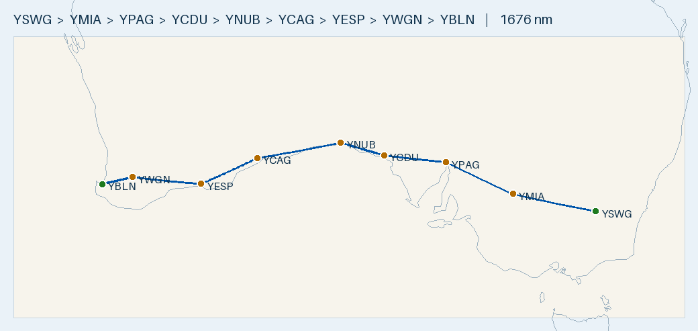

# Flight Plan — YSWG → YBLN (Tecnam P2002, MOGAS-priority) · 3-Day Nullarbor Crossing

**Route:** Wagga Wagga (YSWG) → Mildura (YMIA) → **Port Augusta (YPAG — overnight 1)** → Ceduna (YCDU) → Nullarbor Roadhouse (YNUB) → **Caiguna (YCAG — overnight 2)** → Esperance (YESP) → *Wagin (YWGN — comfort stop)* → Busselton (YBLN)
**Aircraft:** Tecnam P2002 · Rotax 912 ULS · 100 L usable · 20 L/hr · 100 KTAS
**Planning basis:** No wind · **fixed reserve 30 min (10 L) floor — plan to land ≥ 45 min (15 L), treat 30–45 min as a buffer to avoid.**
→ **90 L usable to the floor = 450 nm** (425 nm keeping the 45-min buffer). Longest leg 281 nm / 56 L in still air lands ~1¼ hr above the 45-min buffer; headwind is the only thing that tightens legs.
**Season:** planned **October 2026** (worst case 1 Oct below; Eastern DST from 4 Oct — before then all standard time).
**Data source:** repo's parsed **ERSA FAC/RDS** database (`data/fac_database.sqlite`) — verify against current ERSA + NOTAMs on the day.

> ✈️ **Overview:** ~1,676 nm, ~16 h 46 m airborne, six fuel stops, split over **three relaxed days** (each ≤ ~6½ h
> airborne) with overnights at **Port Augusta** and **Caiguna**. Over-land route shadowing the Eyre Highway/rail — no overwater.
> The unhurried alternative to the 2-day plan; every day finishes with 6½–8¼ h of daylight to spare (worst case).

- 🗺️ **[Interactive version: `maps/YSWG-YBLN.geojson`](maps/YSWG-YBLN.geojson)** — pan/zoom map; click any marker/leg for its code, fuel and distance. (Same route as the 2-day plan — only the overnight split differs. GitHub draws plain pins; coloured markers show in the PNG / geojson.io.)

## Overnight stops & accommodation (airport ↔ town distance matters)
Chosen so each night's bed is close to the aircraft — a real factor out here:
- **Port Augusta (overnight 1):** regional town, airport **~4–5 km W of the CBD** — short taxi/lift to motels. Reliable 24 h AVGAS. Verify current transport/ride options.
- **Caiguna (overnight 2):** the **John Eyre Motel is part of the Caiguna Roadhouse, right beside the airstrip** — **walk from the aircraft**, no transport, with **Mogas + meals on-site.** Basic but ideal for a fly-in night, and it's a Mogas fill point.
- **Deliberately NOT overnighting at Esperance:** its airport is **~22 km from town** — fine as a fuel-only stop, poor as an overnight.

## Fuel strategy — MOGAS-first to save cost (no crew car)
Take **Mogas only where the pump is at the airfield** (no driving into town). Everywhere else, splash **AVGAS**
off the bowser. Requirement: **Premium 95 RON minimum (98 ideal), ethanol-free** — regular 91 ULP is NOT enough
for the 912 ULS. Rotax prefers Mogas anyway (less lead fouling).

| Stop | Fuel taken | Why |
|------|-----------|-----|
| YSWG Wagga Wagga (start) | start tank | AVGAS bowser only (WFS, no strip Mogas) — **bring/pre-load Mogas here if you want to start on it** |
| YMIA Mildura | AVGAS | town bowser |
| YPAG Port Augusta *(o/night 1)* | AVGAS | town bowser (Air BP carnet + credit) |
| YCDU Ceduna | AVGAS | town bowser (Air BP carnet) |
| **YNUB Nullarbor Roadhouse** | **MOGAS** | **servo at the strip** — ph 08 8625 6271 |
| **YCAG Caiguna *(o/night 2)*** | **MOGAS** | **roadhouse servo + motel at the strip** — ph 08 9039 3459 |
| YESP Esperance | AVGAS | town bowser (Myrup Mogas a maybe — confirm) — **last fill before Busselton** |
| YWGN Wagin *(comfort stop)* | none planned | toilet/decision stop on Esperance fuel; its AVGAS is emergency-only |
| YBLN Busselton (dest) | **MOGAS** | your aeroclub supply |

The Mogas backbone from Wagga is **Nullarbor → Caiguna → (home) Busselton**. Overnighting at Caiguna means you fuel
Mogas the evening before and again at Nullarbor that morning. The eastern towns are AVGAS-only without a crew car.
Carry an **Air BP Carnet** as the AVGAS backstop. Caveat: jerry-canning at the roadhouses can take 45–60 min and needs
ethanol-free 95+ confirmed by phone.

### Mogas redundancy across the Nullarbor (not in ERSA — confirm before relying on)
The Eyre Highway roadhouses run car-petrol bowsers, so Mogas is denser than just the two planned stops
(source: aircraftpilots.com Mogas thread + the community **"Outback Fuel" Google map** by JG3 — check before departure):
- **Border Village** (SA/WA border) — backs up **Nullarbor Roadhouse**.
- **Cocklebiddy** (east) and **Balladonia** (west) — back up **Caiguna**.
These strips are not in the ERSA FAC dataset, so runway length/surface/serviceability are unverified here — **phone ahead.**

### White Gum (YWGM) — the one verified extra Mogas field
ERSA-listed self-serve Mogas bowser (east of RWY 14/32), inland near York (~130 nm from Busselton). Substituting it
for the WA tail (…→ YWGM → YBLN) would make the final run Mogas, **but routes through Perth Class C/D airspace** —
rejected here for the simpler, CTA-free Esperance→Wagin→Busselton track. Keep as a Mogas alternative if desired.

## Daylight — worst case 1–3 OCT 2026 (shortest days; verify for actual date)
**Standard time everywhere** (Eastern DST starts Sun 4 Oct): AEST +10, ACST +9.5, AWST +8. Flying west lengthens
the usable day. Margins are absolute/UTC (zone-crossing safe) — and on 3 days they're enormous:

| Day | Depart (first light) | Window (dawn→dusk) | Elapsed | **Margin** |
|-----|----|----|----|----|
| Day 1 Wagga→Port Augusta | Wagga **05:24 AEST** | 13 h 52 m | 5:08 + 0:30 = **5:38** | **+8 h 14 m** |
| Day 2 Port Augusta→Caiguna | Port Augusta **05:33 ACST** | 14 h 02 m | 6:21 + 1:00 = **7:21** | **+6 h 41 m** |
| Day 3 Caiguna→Busselton | Caiguna **04:51 AWST** | 13 h 56 m | 5:17 + ~0:50 = **6:07** | **+7 h 49 m** |

No dawn scramble required — you could depart mid-morning each day and still finish comfortably. (Nullarbor Roadhouse
on Day 2 is reached late morning, well inside its daylight-only hours.)

## DAY 1 — Wagga Wagga → Port Augusta (513 nm, ~5 h 08 m airborne)
| Leg | From → To | Dist | Time | Fuel @20L/hr | Fuel type |
|-----|-----------|-----:|-----:|-------------:|-----------|
| 1 | YSWG Wagga Wagga → YMIA Mildura | 271 nm | 2:43 | 54.2 L | start tank |
| 2 | YMIA Mildura → YPAG Port Augusta | 242 nm | 2:25 | 48.4 L | AVGAS |
| **Day 1** | | **513 nm** | **5:08** | | **overnight Port Augusta** |

- Very short first day — Wagga→Mildura tracks the Riverina/Murray (Hay YHAY is an in-track AVGAS alternate).
- Overnight Port Augusta — town motels ~4–5 km from the field (short taxi/lift); reliable 24 h AVGAS.

## DAY 2 — Port Augusta → Caiguna (635 nm, ~6 h 21 m airborne)
| Leg | From → To | Dist | Time | Fuel @20L/hr | Fuel type |
|-----|-----------|-----:|-----:|-------------:|-----------|
| 3 | YPAG Port Augusta → YCDU Ceduna | 205 nm | 2:03 | 41.0 L | AVGAS |
| 4 | YCDU Ceduna → YNUB Nullarbor Rdhs | 149 nm | 1:29 | 29.8 L | **MOGAS** |
| 5 | YNUB Nullarbor Rdhs → YCAG Caiguna | 281 nm | 2:49 | 56.2 L | **MOGAS** |
| **Day 2** | | **635 nm** | **6:21** | | **overnight Caiguna (roadhouse motel)** |

- The Nullarbor crossing day, but short: top up AVGAS at Ceduna, Mogas at Nullarbor, then Mogas + bed at Caiguna.
- 281 nm Nullarbor→Caiguna is the remote leg — optional split at **Forrest** (YNUB→YFRT 148, YFRT→YCAG 160), but Forrest
  is **PN-required and takes no carnet** (cash/EFTPOS/Visa/MC).

## DAY 3 — Caiguna → Busselton (528 nm, ~5 h 17 m airborne)
Esperance is the **last fuel stop** — from there you tanker enough for the run to Busselton, with **Wagin as an
optional toilet/decision stop** (no fuel needed).
| Leg | From → To | Dist | Time | Fuel @20L/hr | Fuel type |
|-----|-----------|-----:|-----:|-------------:|-----------|
| 6 | YCAG Caiguna → YESP Esperance | 202 nm | 2:01 | 40.4 L | AVGAS (last fill) |
| 7 | YESP Esperance → YWGN Wagin *(comfort stop)* | 225 nm | 2:15 | 45.0 L | — (on Esperance fuel) |
| 8 | YWGN Wagin → YBLN Busselton | 101 nm | 1:00 | 20.2 L | **MOGAS** (aeroclub) |
| **Day 3** | | **528 nm** | **5:17** | | **arrive Busselton** |

Esperance→Wagin→Busselton is **326 nm** (only ~+2 nm over direct) and needs ~81 L of 100 L including reserve. Flying
**direct Esperance→Busselton** (skip Wagin) lands **+61 min above the 45-min buffer** in still air — comfortable in
nil/light wind (keeps the buffer to ~24 kt headwind, hits the 30-min floor only ~28 kt). Wagin's own fuel is
**emergency-only** (Greg Ball 0428 611 360) — a stretch/weather gate, not a planned fill.

**TRIP TOTAL: ~1,676 nm · ~16 h 46 m airborne · ~335 L fuel.**

## Aerodromes
Each code links to its full parsed ERSA data card (fuel + handling verbatim, runways, frequencies, RDS, source PDF).

| Code | Name | ST | Elev | Fuel (bowser) | Runways | CTAF |
|------|------|----|-----:|------|---------|------|
| [YSWG](aerodromes/YSWG.md) | Wagga Wagga | NSW | 724 ft | AVGAS, Jet A1 | 05/23; 12/30 clay | 126.95 |
| [YMIA](aerodromes/YMIA.md) | Mildura | VIC | 167 ft | AVGAS, Jet A1 | 09/27 grooved; 18/36 | 118.8 |
| [**YPAG**](aerodromes/YPAG.md) | **Port Augusta** *(overnight 1)* | SA | 56 ft | AVGAS, Jet A1 | 15/33 | 126.9 |
| [YCDU](aerodromes/YCDU.md) | Ceduna | SA | 77 ft | AVGAS, Jet A1 | **11/29 sealed** (17/35 gravel — avoid) | 126.7 |
| [YNUB](aerodromes/YNUB.md) | Nullarbor Roadhouse | SA | 220 ft | AVGAS + **forecourt Mogas** | roadhouse strip — confirm len/surface | 126.7 |
| [**YCAG**](aerodromes/YCAG.md) | **Caiguna** *(overnight 2 — motel at strip)* | WA | 287 ft | AVGAS + **forecourt Mogas** | roadhouse strip — confirm len/surface | 126.7 |
| [YESP](aerodromes/YESP.md) | Esperance *(last fuel; ~22 km to town)* | WA | 471 ft | AVGAS, Jet A1 | 11/29; 03/21 gravel | 126.7 |
| [YWGN](aerodromes/YWGN.md) | Wagin *(comfort stop)* | WA | 836 ft | AVGAS **emergency-only** (Greg Ball 0428 611 360) | — | 126.7 |
| [YBLN](aerodromes/YBLN.md) | Busselton | WA | 56 ft | AVGAS + club Mogas | 03/21 grooved | 127.0 |
| [YABA](aerodromes/YABA.md) | Albany *(headwind diversion)* | WA | 233 ft | AVGAS, Jet A1 | 05/23; 14/32 | 127.85 |
| [YFRT](aerodromes/YFRT.md) | Forrest *(Nullarbor split alt)* | WA | 511 ft | AVGAS, Jet A1 | — | 126.7 |
| [YWGM](aerodromes/YWGM.md) | White Gum *(Mogas alt, Perth CTA)* | WA | — | **MOGAS** bowser | — | — |

## Fuel cards & payment (carry Air BP Carnet + Visa/MC + cash)
| Stop | Provider | Payment | Notes |
|------|----------|---------|-------|
| YSWG Wagga Wagga | WFS | Carnet, Visa/MC via Compac Pay app, fuel card | 24 h AVGAS bowser |
| YMIA Mildura | WFS | Carnet, Visa/MC via app | 24 hr bowser |
| YPAG Port Augusta *(o/night 1)* | Flying Fuels | Carnet + credit | 24 hr swipe |
| YCDU Ceduna | Air BP | **Carnet ONLY** | H24 swipe; assisted bus. hrs + PN |
| YNUB Nullarbor Rdhs | roadhouse | **Mogas: cash/EFTPOS at forecourt** — ph 08 8625 6271 | AVGAS bowser daylight only |
| YCAG Caiguna *(o/night 2)* | roadhouse | **Mogas: cash/EFTPOS at forecourt** — ph 08 9039 3459 | H24; motel on site |
| YESP Esperance *(last fill)* | Air BP | Carnet (H24); credit/cash 60 min PN | tanker to Busselton from here |
| YWGN Wagin *(comfort stop)* | Greg Ball (private) | **AVGAS emergency-only — pre-arrange by phone** | 0428 611 360; not a planned fill |
| YABA Albany *(diversion)* | Air BP | Carnet | 24 hr bowser — use if headwind forces a fill |
| YBLN Busselton | ABP / City + aeroclub | Carnet (public) / club (Mogas) | Phone AD OPR |

## Pre-flight checks
- [ ] **Air BP Carnet** carried (only accepted method at Ceduna; public bowser at Busselton).
- [ ] **Confirm Mogas + a room ahead** at Caiguna (08 9039 3459) and Mogas at Nullarbor (08 8625 6271): **95+ RON ethanol-free**; allow 45–60 min decant.
- [ ] **Book Port Augusta accommodation** + confirm airport transport (~4–5 km to town).
- [ ] If you want to start on Mogas, **pre-load it at Wagga** (WFS bowser is AVGAS only — Wagga is not a known Mogas field).
- [ ] Confirm roadhouse strip length/surface/serviceability + daylight hours on current ERSA/NOTAMs.
- [ ] Pull **actual first/last light** for the date (margins are large on 3 days, but still verify).
- [ ] Full tanks out of every stop; **≥30-min reserve (aim to land with 45) on top of trip fuel every leg**; W&B at each fuel load.
- [ ] ARFOR + TAFs; **NOTAMs** (Nullarbor); winds (a >20 kt headwind adds ~25% — plenty of daylight buffer on 3 days).
- [ ] Remote-area kit for the crossing: survival gear, PLB, water, SARTIME/flight following.

## Alternatives considered
- **2-day version:** same route, overnight at Ceduna — see `YSWG-YBLN_P2002_MOGAS_2day.md`. Day 2 there is a full ~9½ h airborne day; this 3-day plan trades a night for much shorter days and closer beds.
- **Overnight Nullarbor instead of Caiguna:** unbalances the split and Nullarbor's AVGAS bowser is daylight-only; Caiguna is H24 with an on-strip motel.
- **Esperance→Busselton via Wagin (chosen):** ~324 nm direct lands +61 min above the 45-min buffer in still air, so no fuel stop is needed; Wagin (+2 nm) is a comfort/decision gate, Albany a headwind diversion.

---
*Planning only. Cross-check current ERSA, NOTAMs, weather, daylight and the aircraft POH before flight.*
